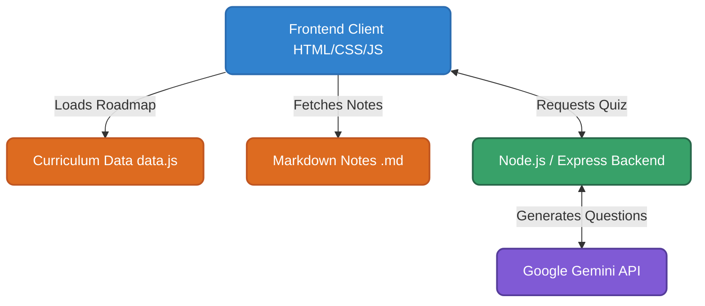

# Curriculum Learning Ground 🚀

## 📖 About the Project

Curriculum Learning Ground is a comprehensive, self-hosted educational platform tailored for developers, engineers, and data scientists. The core goal of this project is to centralize high-quality, roadmap-driven curriculums (such as AI Engineering, Full Stack Development, and Data Analytics) into a single, interactive dashboard.

Instead of jumping between dozens of tutorials, tabs, and websites, this application offers an "all-in-one" distraction-free environment. You can track your long-term progress, read deeply technical markdown notes natively in the browser, and test your knowledge with dynamic AI-generated quizzes—all wrapped in a stunning Neumorphic (Soft UI) aesthetic.

## ✨ Features

- **Beautiful Neumorphism UI:** A sleek, extruded soft-UI interface with micro-animations that makes interacting with tasks feel incredibly tactile.
- **Dynamic Progress Tracking:** Visual progress bars automatically update as you check off curriculum tasks.
- **Embedded Document Reader:** A fully integrated Markdown reader with a dedicated "Dark Mode" modal for late-night reading without leaving the app.
- **AI-Powered Assessments:** Built-in generative AI (via Google Gemini) generates dynamic quizzes on the fly based on your selected subjects.
- **Mermaid Diagram Support:** Technical notes automatically render complex architecture diagrams natively in the browser.
- **Modular Curriculum:** Easily expandable architecture allows you to add new learning roadmaps with zero structural changes.

## 🛠️ Technology Stack & Architecture

Here is a high-level overview of how the application is structured:



- **Frontend:** HTML5, CSS3 (Vanilla), JavaScript (ES6+)
- **Backend:** Node.js, Express.js
- **AI Integration:** `@google/genai` (Gemini API)
- **Markdown Parsing:** `marked.js`
- **Diagrams:** `mermaid.js`

## 🚀 Getting Started

### Prerequisites
Make sure you have [Node.js](https://nodejs.org/) installed on your machine.

### Installation

1. **Clone the repository:**
   ```bash
   git clone https://github.com/jagadeesvarrao-design/learning-website-.git
   cd learning-website-
   ```

2. **Install dependencies:**
   ```bash
   npm install
   ```

3. **Set up Environment Variables:**
   Create a `.env` file in the root directory and add your Google Gemini API key:
   ```env
   GEMINI_API_KEY=your_api_key_here
   PORT=3000
   ```

4. **Run the server:**
   ```bash
   node server.js
   ```

5. **Open the app:**
   Navigate to `http://localhost:3000` in your web browser.

## 📖 How to Use

1. **Select a Subject:** Use the personalization panel at the top to choose a curriculum (e.g., AI Engineering, Full Stack).
2. **Read Notes:** Click the "Read Notes" button on any topic to open the dark-mode document reader.
3. **Track Progress:** Check the circular checkboxes as you complete topics. The progress bar will automatically update.
4. **Take Quizzes:** Click "Take AI Quiz" to generate an assessment. Passing the quiz will automatically mark the topic as complete!

## 🤝 Contributing
Contributions, issues, and feature requests are welcome! Feel free to check the issues page.

## 📝 License
This project is [MIT](https://choosealicense.com/licenses/mit/) licensed.
