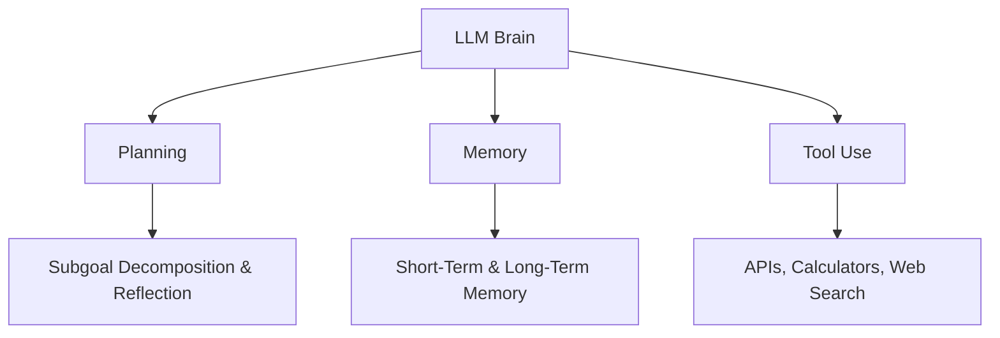
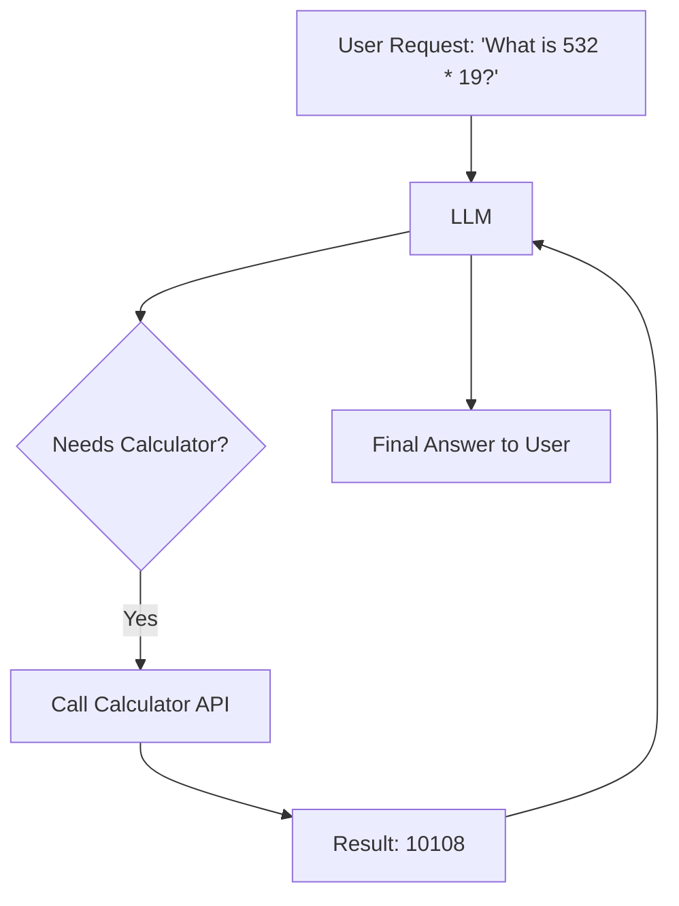

# LLM Powered Autonomous Agents

Welcome to the elaborate, beginner-friendly notes for "LLM Powered Autonomous Agents" inspired by Lilian Weng's famous blog post. This guide explores how Large Language Models can act as the brain of autonomous agents.

## 1. Agent System Overview
In an LLM-powered autonomous agent system, the LLM functions as the agent's brain, complemented by several key components: Planning, Memory, and Tool use.



## 2. Component One: Planning
Planning involves breaking down large tasks and learning from past actions.

### Subgoal and Decomposition
The agent breaks down large tasks into smaller, manageable subgoals. Techniques like Chain of Thought (CoT) or Tree of Thoughts (ToT) are used.

```python
# LLM Prompt for Task Decomposition
prompt = """
Task: Write a complete weather application.
Decompose this task into 3 manageable steps.
"""
# Response: 1. Setup API, 2. Build Frontend UI, 3. Connect API to UI.
```

### Reflection and Refinement
The agent critiques its own past actions and refines its execution plan. (e.g., ReAct framework - Reason and Act).


## 3. Component Two: Memory
Memory allows the agent to recall context over time.

### Types of Memory
- **Sensory Memory**: Immediate, raw inputs (e.g., embedding of the current prompt).
- **Short-Term Memory**: In-context learning (the context window of the LLM).
- **Long-Term Memory**: Information stored in an external vector database, retrieved when needed.

### Maximum Inner Product Search (MIPS)
Used to fetch the most relevant memories from a vector database. It finds the vector in the database that has the maximum inner product (cosine similarity) with the query vector.

```python
import numpy as np

def cosine_similarity(v1, v2):
    return np.dot(v1, v2) / (np.linalg.norm(v1) * np.linalg.norm(v2))

query_vector = np.array([0.1, 0.5, 0.2])
memory_vector = np.array([0.2, 0.4, 0.1])
print(f"Similarity: {cosine_similarity(query_vector, memory_vector)}")
```

## 4. Component Three: Tool Use
LLMs are limited by their training data cutoff and inability to do precise math. Tool use allows them to call external APIs to get information or execute actions.



```python
# Function Calling Example
tools = [
    {
        "name": "calculator",
        "description": "Multiplies two numbers",
        "parameters": {"a": "int", "b": "int"}
    }
]
```

## 5. Case Studies
Examples of autonomous agents in action.

### Scientific Discovery Agent
ChemCrow, an agent equipped with 13 expert-designed tools to plan and execute chemical syntheses.

### Generative Agents Simulation
The Stanford Smallville paper where 25 virtual characters (agents) interact in a sandbox environment, forming memories, routines, and relationships.

### Proof-of-Concept Examples
- **AutoGPT**: An experimental open-source attempt to make GPT-4 fully autonomous.
- **BabyAGI**: A Python script that creates tasks, executes them, and prioritizes new tasks based on the results.

## 6. Conclusion
LLM-powered autonomous agents are a massive leap toward Artificial General Intelligence (AGI), turning static models into dynamic workers capable of reasoning, learning, and acting in complex environments.
