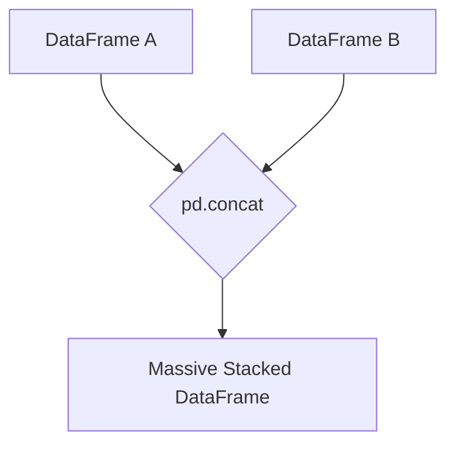

# Data Manipulation (Kaggle Pandas Mirror)

This handbook mirrors the exact curriculum from the **Kaggle Learn Pandas Course**. Pandas is the most popular Python library for data manipulation and analysis, acting as the foundation for any Machine Learning pipeline.

---

## 1. Creating, Reading and Writing

Before you can manipulate data, you need to load it into Pandas. The two core data structures are the **DataFrame** and the **Series**.

### DataFrames & Series
*   **DataFrame:** A two-dimensional table of data with rows and columns (just like Excel or SQL).
*   **Series:** A single column of a DataFrame. It is a sequence of data values.

```python
import pandas as pd

# Creating a DataFrame manually
df = pd.DataFrame({'Yes': [50, 21], 'No': [131, 2]})

# Creating a Series manually
s = pd.Series([1, 2, 3, 4, 5], name='Product_A_Sales')
```

### Reading and Writing Data
Data usually comes in CSV (Comma-Separated Values) format.
```python
# Read from a CSV file
wine_reviews = pd.read_csv("winemag-data-130k-v2.csv", index_col=0)

# Check the first 5 rows
print(wine_reviews.head())

# Write back to a new CSV file
wine_reviews.to_csv("my_cleaned_data.csv")
```

---

## 2. Indexing, Selecting & Assigning

To work with data, you must know how to pull specific pieces out of a massive table.

### Native Accessors vs loc/iloc
While you can use native Python dictionary syntax `reviews['country']` or dot notation `reviews.country`, Pandas provides its own advanced accessors: `iloc` (index-based) and `loc` (label-based).

*   **`iloc` (Integer location):** Selects data based on its numerical position in the table.
    ```python
    # Select the very first row
    first_row = reviews.iloc[0]
    
    # Select the first 3 rows of the first column
    subset = reviews.iloc[:3, 0]
    ```

*   **`loc` (Label location):** Selects data based on the index label (e.g., column names).
    ```python
    # Select the 'country' column for the first row
    country = reviews.loc[0, 'country']
    
    # Select specific columns
    details = reviews.loc[:, ['taster_name', 'taster_twitter_handle', 'points']]
    ```

### Conditional Selection
You can ask questions of your data to filter it.
```python
# Find all wines from Italy that scored higher than 90 points
great_italian_wines = reviews[(reviews.country == 'Italy') & (reviews.points >= 90)]
```

---

## 3. Summary Functions and Maps

Often, you want to summarize your data or transform it before training an AI model.

### Summary Functions
```python
# Get mean, min, max, and percentiles for all numeric columns
reviews.describe()

# Get a list of unique countries
reviews.country.unique()

# See how often each country appears
reviews.country.value_counts()
```

### Maps
Mapping allows you to apply a custom function to every single value in a column.
```python
# Let's say we want to subtract the mean score from every wine's score
review_points_mean = reviews.points.mean()

# Using the .apply() method
centered_points = reviews.points.apply(lambda p: p - review_points_mean)
```

---

## 4. Grouping and Sorting

Grouping data allows you to perform operations across specific categories.

### Grouping (`groupby`)
```python
# Find the cheapest wine for each point-value category
cheapest_per_point = reviews.groupby('points').price.min()

# Count how many wines each country produces
wine_counts = reviews.groupby('country').size()
```

### Sorting (`sort_values`)
By default, data is ordered by its original index. You can reorder it based on values in specific columns.
```python
# Sort the DataFrame by price, from most expensive to cheapest
sorted_by_price = reviews.sort_values(by='price', ascending=False)
```

---

## 5. Data Types and Missing Values

Real-world data is dirty. It has missing values (`NaN`) and incorrect data types.

### Dtypes
The data type of a column is known as the `dtype`.
```python
# Check data types
print(reviews.dtypes)

# Convert a column from float64 to int64
reviews.points = reviews.points.astype('int64')
```

### Missing Data
Missing data in Pandas is given the value `NaN` (Not a Number). Machine Learning models will crash if you feed them `NaN`s.
```python
# Find rows where the country is missing
missing_country = reviews[pd.isnull(reviews.country)]

# Fill missing values with 'Unknown'
reviews.region_2.fillna("Unknown")

# Alternatively, just drop all rows that contain missing data
clean_df = reviews.dropna()
```

---

## 6. Renaming and Combining

Sometimes data comes from multiple sources, or the column names are impossible to read.

### Renaming
```python
# Rename a column from 'points' to 'score'
reviews.rename(columns={'points': 'score'})

# Rename the index
reviews.rename_axis("wines", axis='rows')
```

### Combining DataFrames
If you have two separate CSV files, you can join them together using `concat` or `join`.
*   **`concat`**: Stacks DataFrames on top of each other (like combining January data and February data).
*   **`join`**: Merges DataFrames side-by-side based on a common index (like a SQL JOIN).


