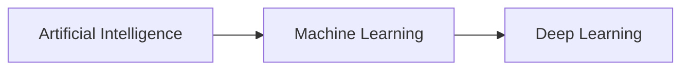
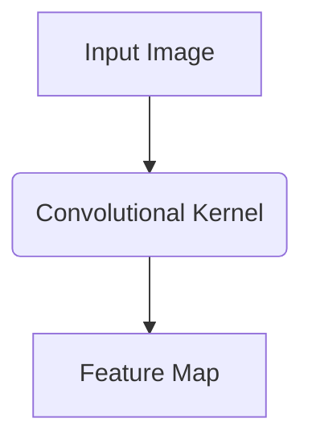
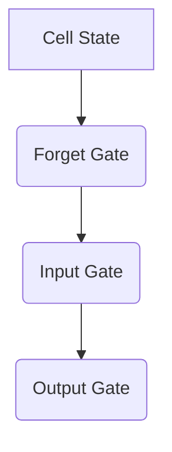
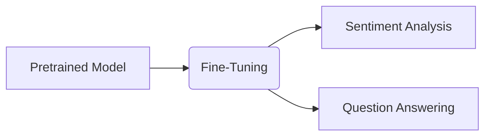

# Dive into Deep Learning (D2L)

Welcome to the elaborate, beginner-friendly notes for "Dive into Deep Learning" (D2L). This comprehensive guide mirrors the official table of contents of the D2L curriculum.

## 1. Introduction
Deep learning is a subset of machine learning that utilizes neural networks with many layers (hence "deep") to learn representations of data.



## 2. Preliminaries
Before diving into deep learning, we must understand the fundamental math and programming paradigms.

### Linear Algebra
Tensors are the fundamental data structures in deep learning.

```python
import torch

# Creating a 1D tensor (vector)
x = torch.tensor([1.0, 2.0, 3.0])

# Creating a 2D tensor (matrix)
A = torch.tensor([[1, 2], [3, 4]])
print(f"Matrix A:\n{A}")
```

### Calculus
Derivatives and gradients are essential for optimization.

```mermaid
graph TD
    A[Function f(x)] --> B[Derivative f'(x)]
    B --> C[Rate of change of f at x]
    C --> D[Gradient Descent Optimization]
```

## 3. Linear Neural Networks
The simplest form of neural networks.

### Linear Regression
Implemented from scratch and concisely using a framework.

```python
from torch import nn

# A simple linear model in PyTorch
net = nn.Sequential(nn.Linear(2, 1))

# Loss function
loss = nn.MSELoss()

# Optimizer
trainer = torch.optim.SGD(net.parameters(), lr=0.03)
```

### Softmax Regression
Used for multi-class classification, converting outputs to a probability distribution.

## 4. Multilayer Perceptrons (MLPs)
Introducing hidden layers and non-linear activation functions.

```mermaid
graph LR
    A[Input Layer] --> B[Hidden Layer (ReLU)]
    B --> C[Output Layer]
```

```python
# MLP in PyTorch
mlp = nn.Sequential(
    nn.Linear(20, 256),
    nn.ReLU(),
    nn.Linear(256, 10)
)
```

## 5. Deep Learning Computation
How deep learning frameworks manage layers, parameters, and GPUs.

### Parameter Management
Accessing and initializing model weights.

```python
# Initialize weights
def init_weights(m):
    if type(m) == nn.Linear:
        nn.init.normal_(m.weight, std=0.01)

mlp.apply(init_weights)
```

## 6. Convolutional Neural Networks (CNNs)
Designed for processing grid-like data such as images.

### Cross-Correlation Operation
The core operation in a convolutional layer.



```python
# Convolutional layer
conv2d = nn.Conv2d(in_channels=1, out_channels=1, kernel_size=3, padding=1)
```

## 7. Modern Convolutional Neural Networks
Exploring breakthrough architectures like AlexNet, VGG, NiN, GoogLeNet, and ResNet.

### ResNet (Residual Networks)
Introduces skip connections to solve the vanishing gradient problem in very deep networks.

```mermaid
graph TD
    A[Input x] --> B[Weight Layer]
    B --> C[ReLU]
    C --> D[Weight Layer]
    A --> E[+]
    D --> E
    E --> F[Output F(x) + x]
```

## 8. Recurrent Neural Networks (RNNs)
Neural networks for processing sequential data.

### Sequence Models
Language models predicting the next word.

```python
# Simple RNN layer in PyTorch
rnn_layer = nn.RNN(input_size=10, hidden_size=20)
```

## 9. Modern Recurrent Neural Networks
Addressing the limitations of standard RNNs with GRUs and LSTMs.

### LSTM (Long Short-Term Memory)
Uses gating mechanisms (forget, input, output gates) to retain long-term information.



## 10. Attention Mechanisms
Allowing models to focus on specific parts of the input sequence.

### Transformers
The architecture that revolutionized NLP, relying entirely on self-attention.

```python
# Multi-head attention layer
attention = nn.MultiheadAttention(embed_dim=256, num_heads=8)
```

## 11. Optimization Algorithms
Techniques beyond simple SGD, such as Adam, RMSprop, and learning rate scheduling.

## 12. Computational Performance
Hardware acceleration, multi-GPU training, and parameter servers.

## 13. Computer Vision
Object detection, semantic segmentation, and style transfer.

## 14. Natural Language Processing
Pretraining (Word2Vec, BERT) and fine-tuning for downstream tasks.


