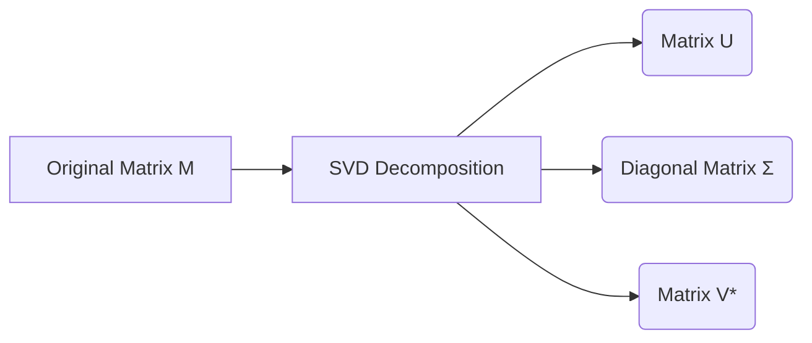

# Mathematics for Machine Learning (Book Mirror)

This handbook strictly mirrors the curriculum of the official **"Mathematics for Machine Learning"** textbook by Deisenroth, Faisal, and Ong. It is broken into two main parts: Mathematical Foundations and Central Machine Learning Problems.

---

## Part I: Mathematical Foundations

### Chapter 1: Introduction and Motivation
Machine learning is fundamentally about building mathematical models to understand data. To do this, we need a common language: Mathematics. This section establishes why we need Linear Algebra (to handle data), Calculus (to optimize models), and Probability (to handle uncertainty).

### Chapter 2: Linear Algebra
Linear algebra is the study of vectors and specific rules to manipulate them.
*   **Vectors & Matrices:** We represent a dataset with $N$ examples and $D$ features as an $N \times D$ matrix.
*   **Systems of Linear Equations:** The core of many ML problems (like Linear Regression) boils down to solving $Ax = b$.
*   **Vector Spaces & Basis:** A set of vectors that can represent any point in a space.

```python
import numpy as np

# A 2x2 Matrix (A) and a vector (b)
A = np.array([[2, 1], [1, 3]])
b = np.array([5, 5])

# Solving the linear equation Ax = b
x = np.linalg.solve(A, b)
print(f"Solution x: {x}") 
```

### Chapter 3: Analytic Geometry
Analytic geometry defines how we measure distances and angles between vectors.
*   **Inner Products:** The dot product tells us how aligned two vectors are.
*   **Norms:** The length of a vector (e.g., L1 and L2 norms are crucial for Regularization in ML).
*   **Orthogonality:** When two vectors are perpendicular (their dot product is 0).

### Chapter 4: Matrix Decompositions
We often need to break a complex matrix down into simpler, constituent parts to understand it.
*   **Determinant & Trace:** Single numbers that summarize a matrix.
*   **Eigenvalues and Eigenvectors:** Vectors that only stretch (but don't rotate) when a specific matrix is applied to them. This is the absolute foundation of PCA (Principal Component Analysis).
*   **Singular Value Decomposition (SVD):** A way to decompose *any* matrix, widely used in recommendation systems.



### Chapter 5: Vector Calculus
To train a machine learning model, we must find the minimum of an error function. 
*   **Differentiation:** Finding the slope of a curve.
*   **Gradients:** The generalization of derivatives to multiple dimensions. The gradient always points in the direction of steepest ascent.
*   **Backpropagation:** The algorithm that uses the Chain Rule of calculus to compute gradients in Deep Neural Networks.

### Chapter 6: Probability and Distributions
Data is noisy. Probability provides a framework to quantify this uncertainty.
*   **Sum Rule & Product Rule:** The foundations of probability.
*   **Bayes' Theorem:** How to update your beliefs when you see new data. $P(\text{Model}|\text{Data}) = \frac{P(\text{Data}|\text{Model}) P(\text{Model})}{P(\text{Data})}$
*   **Gaussian Distribution:** The bell curve. The most important distribution in ML.

### Chapter 7: Continuous Optimization
Optimization is the process of finding the "best" parameters for our model.
*   **Gradient Descent:** Iteratively taking steps in the opposite direction of the gradient to find a minimum.
*   **Convexity:** If a function is convex, any local minimum is guaranteed to be the global minimum. (Neural networks are highly non-convex, which is why training them is hard!)

---

## Part II: Central Machine Learning Problems

### Chapter 8: When Models Meet Data
How do we actually apply the math from Part I to real data?
*   **Data as Vectors:** We represent images, text, or audio as numerical vectors.
*   **Parameter Estimation:** Using Maximum Likelihood Estimation (MLE) or Maximum a Posteriori (MAP) to find the best model parameters.

### Chapter 9: Linear Regression
The simplest form of supervised learning. We want to draw a line (or hyperplane) through our data points that minimizes the squared distances to the points.
*   **Mathematical Solution:** The optimal parameters can be found analytically using the Moore-Penrose Pseudoinverse.

```python
# Solving Linear Regression analytically using the Pseudoinverse
# y = Xw. Therefore, w = (X^T * X)^-1 * X^T * y
X = np.array([[1, 1], [1, 2], [1, 3]]) # Features (with a column of 1s for the bias)
y = np.array([1, 2, 2]) # Labels

X_transpose = X.T
w = np.linalg.inv(X_transpose.dot(X)).dot(X_transpose).dot(y)
print(f"Optimal Weights: {w}")
```

### Chapter 10: Dimensionality Reduction with PCA
High-dimensional data (like 1024x1024 images) is hard to process. Principal Component Analysis (PCA) uses Eigenvectors (from Chapter 4) to project the data into a lower-dimensional space while preserving as much variance as possible.

### Chapter 11: Density Estimation with Gaussian Mixture Models
An unsupervised learning technique. We assume the data was generated by a mixture of several Gaussian distributions and use the Expectation-Maximization (EM) algorithm to find them.

### Chapter 12: Classification with Support Vector Machines
Support Vector Machines (SVMs) draw a boundary between categories. They rely on Analytic Geometry (Chapter 3) to maximize the "margin" (distance) between the closest data points and the decision boundary. Using the "Kernel Trick", they can classify non-linear data by mapping it to an infinite-dimensional space!
