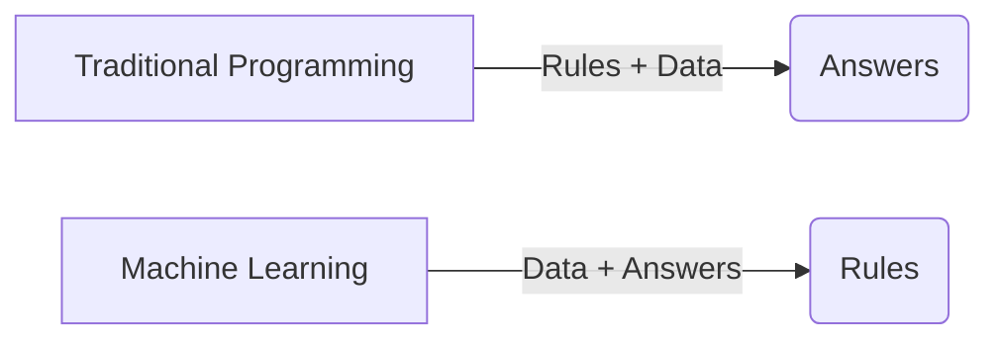
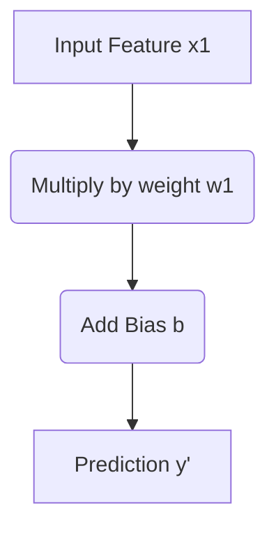
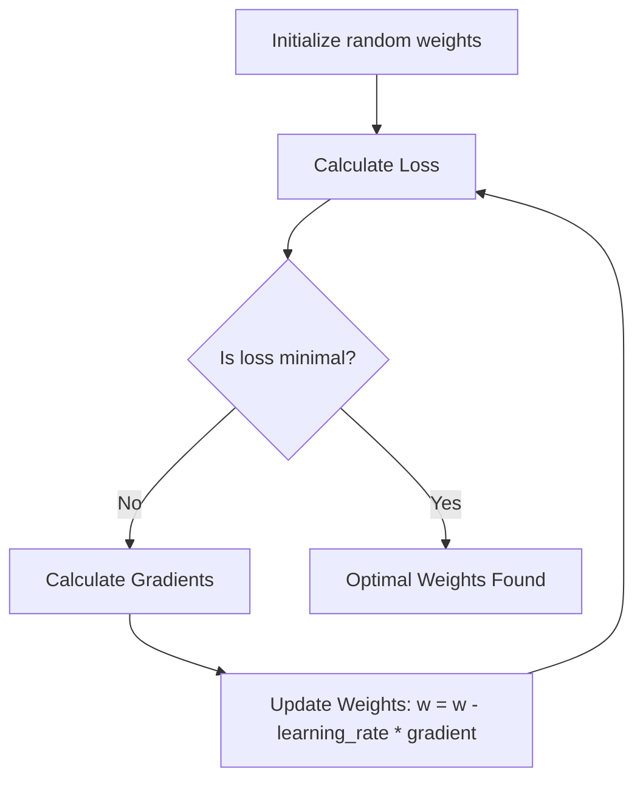
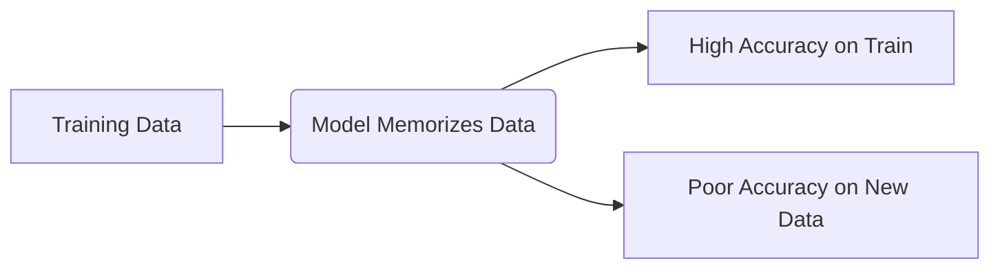
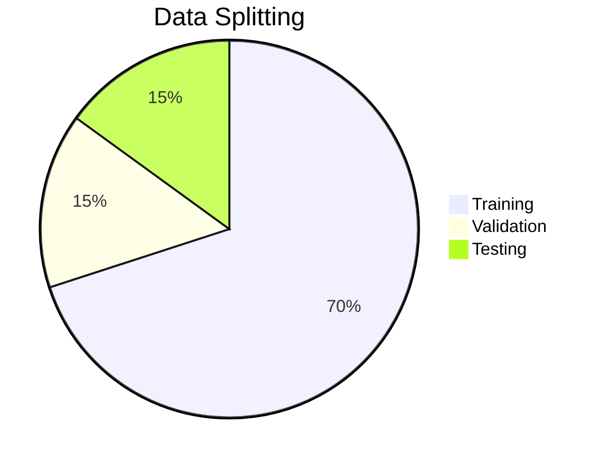
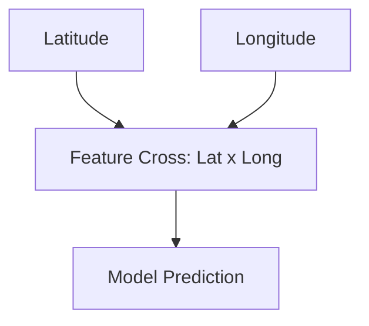
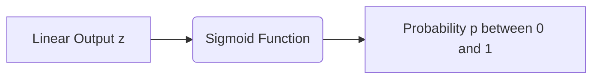
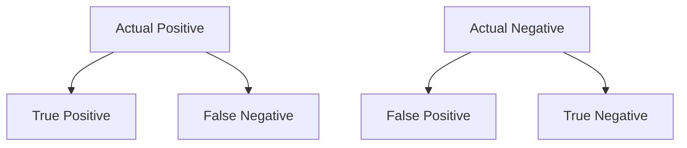
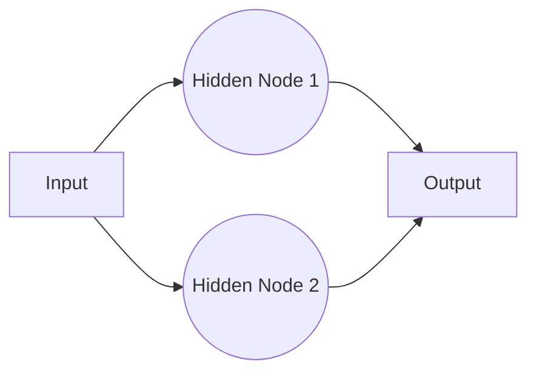

# Google Machine Learning Crash Course

Welcome to the incredibly elaborate notes for the Google Machine Learning Crash Course. This document mirrors the structure of the official course but provides deeper explanations, code examples, and visual Mermaid diagrams tailored for beginners.

## 1. Framing
Machine Learning is the science of making computers learn and act like humans by feeding them data and information without being explicitly programmed.

### Concept Overview
In traditional programming, you provide rules and data to get answers. In machine learning, you provide answers and data to get rules.



### Key Terminology
- **Label**: The thing we're predicting (the `y` variable).
- **Feature**: An input variable (the `x` variable).
- **Example**: A particular instance of data, `x`.
- **Model**: Defines the relationship between features and label.

```python
# Simple example of features and a label in Python
features = [[1200, 2], [1500, 3], [1000, 1]] # Size (sq ft), Bedrooms
labels = [200000, 250000, 150000] # House Price (USD)
```

## 2. Descending into ML
Here we explore how a machine learning model is trained. Linear regression is the starting point.

### Linear Regression
Linear regression tries to find a line that best fits the data points.
Equation: y' = b + w1*x1
- y' is the predicted label
- b is the bias (y-intercept)
- w1 is the weight of feature 1
- x1 is a feature



## 3. Reducing Loss
How does the model know if its predictions are good? We use a loss function.

### Mean Squared Error (MSE)
MSE is the average squared loss per example over the whole dataset.

```python
import numpy as np

def calculate_mse(y_true, y_pred):
    return np.mean((np.array(y_true) - np.array(y_pred))**2)

y_true = [3, -0.5, 2, 7]
y_pred = [2.5, 0.0, 2, 8]
print(f"MSE: {calculate_mse(y_true, y_pred)}")
```

### Gradient Descent
We minimize loss using Gradient Descent, an algorithm that iteratively adjusts weights and biases to find the lowest possible loss.



## 4. First Steps with TensorFlow
TensorFlow and Keras make it easy to build ML models.

```python
import tensorflow as tf
from tensorflow.keras import layers

# Build a simple linear regression model
model = tf.keras.Sequential([
  layers.Dense(units=1, input_shape=[1])
])

model.compile(optimizer=tf.keras.optimizers.RMSprop(learning_rate=0.1),
              loss='mean_squared_error')
```

## 5. Generalization
Generalization refers to a model's ability to adapt properly to new, previously unseen data.

### Overfitting
A model that overfits has low training loss but high test loss.



## 6. Training and Test Sets
To evaluate generalization, we split our data.
- **Training Set**: Used to train the model.
- **Test Set**: Used to evaluate the model's performance.

```python
from sklearn.model_selection import train_test_split

X = [[1], [2], [3], [4], [5], [6]]
y = [1, 2, 3, 4, 5, 6]
X_train, X_test, y_train, y_test = train_test_split(X, y, test_size=0.2)
```

## 7. Validation Sets
A validation set helps tune hyperparameters without peeking at the test set.



## 8. Representation & Feature Engineering
Translating raw data into features that an ML model can use.

### One-Hot Encoding
Converting categorical data to numerical vectors.
```python
import pandas as pd

data = pd.DataFrame({'color': ['red', 'blue', 'green']})
encoded = pd.get_dummies(data, columns=['color'])
print(encoded)
```

## 9. Feature Crosses
Combining two or more categorical features into a single feature.



## 10. Regularization for Simplicity (L2)
L2 Regularization (Ridge) adds a penalty for high weights, keeping the model simple and reducing overfitting.

```python
# L2 Regularization in Keras
from tensorflow.keras import regularizers
layer = layers.Dense(64, kernel_regularizer=regularizers.l2(0.01))
```

## 11. Logistic Regression
Used for binary classification problems (predicting probabilities between 0 and 1).



```python
import math
def sigmoid(z):
    return 1 / (1 + math.exp(-z))
```

## 12. Classification
Evaluating a logistic regression model.

### Confusion Matrix


## 13. Regularization for Sparsity (L1)
L1 Regularization (Lasso) drives the weights of uninformative features to exactly 0, creating a sparse model.

## 14. Neural Networks
When linear relationships aren't enough, we use hidden layers with non-linear activation functions (like ReLU).



```python
model = tf.keras.Sequential([
  layers.Dense(units=64, activation='relu', input_shape=[10]),
  layers.Dense(units=1)
])
```

## 15. Multi-Class Neural Networks
For classifying into more than 2 classes. Uses **Softmax**.

## 16. Embeddings
Translating sparse vectors into lower-dimensional dense vectors.
