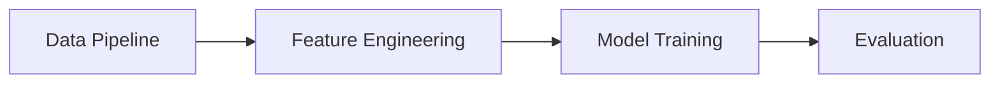
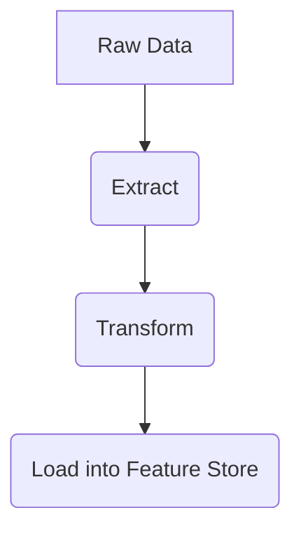
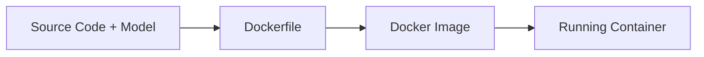

# Made With ML

Welcome to the elaborate, beginner-friendly notes for "Made With ML". This comprehensive guide mirrors the official table of contents of the Made With ML curriculum, focusing on deploying machine learning models into production (MLOps).

## 1. Foundations
Before building models, you need a strong software engineering foundation.

### Python, NumPy, Pandas, PyTorch
- **Python**: The language of ML.
- **NumPy**: Fast numerical computation.
- **Pandas**: Data manipulation.
- **PyTorch**: The deep learning framework.

```python
import pandas as pd
import torch

# Load data
df = pd.DataFrame({'feature_1': [1, 2, 3], 'target': [0, 1, 0]})
# Convert to tensor
tensor_data = torch.tensor(df.values)
```

## 2. Machine Learning
Building the actual models.

### Linear & Logistic Regression
The baseline models for continuous and categorical predictions.

### Neural Networks
Deep learning models for complex, non-linear relationships.



## 3. MLOps
Machine Learning Operations ensures models are reliable, scalable, and maintainable.

### Packaging
Structuring your ML code as a robust Python package rather than a messy Jupyter Notebook.

### Testing
Writing unit tests for data, models, and code.

```python
# A simple Pytest example for a model function
def test_model_output_shape():
    model = MyModel()
    dummy_input = torch.randn(1, 10)
    output = model(dummy_input)
    assert output.shape == (1, 2) # Assuming binary classification
```

### Reproducibility
Fixing seeds and documenting environments so anyone can reproduce the exact same model.

## 4. Data Engineering
Handling data efficiently at scale.



## 5. Model Engineering
Iterating on the model to improve performance.

### Experiment Tracking
Using tools like MLflow or Weights & Biases (WandB) to track metrics across different runs.

```python
import mlflow

mlflow.start_run()
mlflow.log_param("learning_rate", 0.01)
mlflow.log_metric("accuracy", 0.95)
mlflow.end_run()
```

### Hyperparameter Tuning
Automating the search for the best model parameters using techniques like Grid Search or Bayesian Optimization (e.g., Ray Tune).

## 6. Deployment
Getting the model into the hands of users.

### REST API
Serving the model via a FastAPI endpoint.

```python
from fastapi import FastAPI
app = FastAPI()

@app.post("/predict")
def predict(data: dict):
    # Process data and run inference
    return {"prediction": "class_1"}
```

### Docker
Containerizing the API so it runs consistently across any environment.



### CI/CD
Continuous Integration (running tests on PRs) and Continuous Deployment (automatically deploying passing code using GitHub Actions).
