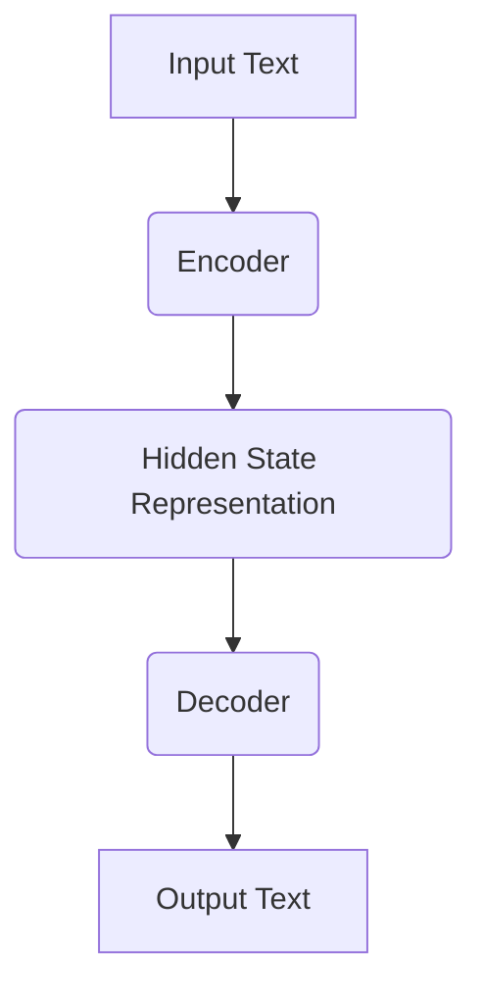
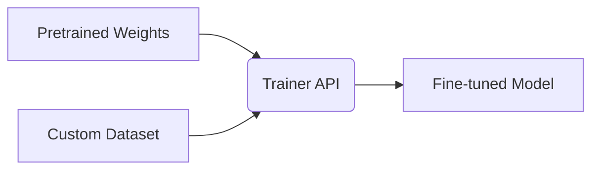
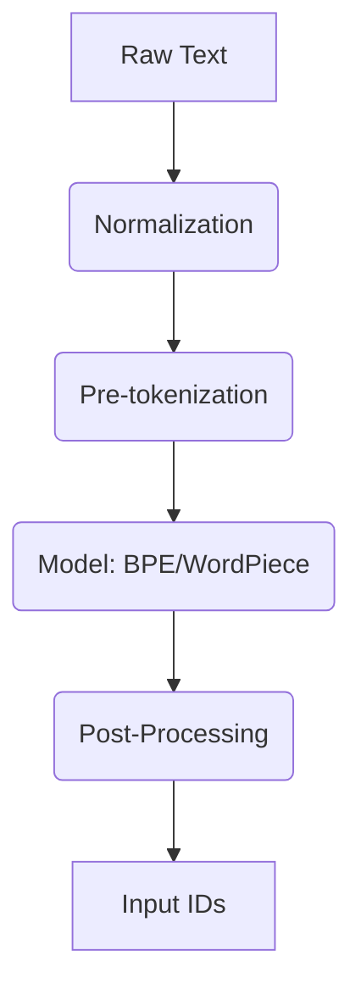
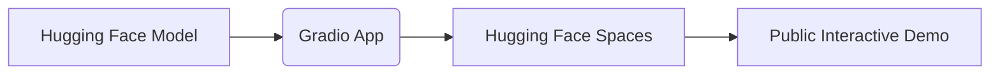

# Hugging Face NLP Course

Welcome to the elaborate, beginner-friendly notes for the Hugging Face NLP Course. This guide mirrors the official table of contents of the Hugging Face curriculum, providing deep explanations, code examples, and diagrams.

## 1. Transformer Models
Transformer models have revolutionized NLP by solving the bottleneck of sequential processing (like in RNNs) using the attention mechanism.

### The Architecture
A Transformer typically consists of an Encoder and a Decoder.
- **Encoder**: Processes the input sequence. Models like BERT are encoder-only.
- **Decoder**: Generates the output sequence. Models like GPT are decoder-only.
- **Encoder-Decoder**: Models like T5 or BART use both.



## 2. Using Transformers
The `transformers` library provides the `pipeline` API, which abstracts the complex process of model loading, tokenization, and inference.

### Pipelines
Pipelines are the easiest way to use models for inference.

```python
from transformers import pipeline

# Sentiment Analysis pipeline
classifier = pipeline("sentiment-analysis")
result = classifier("I love Hugging Face!")
print(result)
```

## 3. Fine-tuning a pretrained model
Instead of training a model from scratch, we take a model pretrained on a large corpus and fine-tune it on a specific, smaller dataset.

### Trainer API
Hugging Face provides the `Trainer` class to simplify training loops.



```python
from transformers import Trainer, TrainingArguments

training_args = TrainingArguments("test-trainer")
trainer = Trainer(
    model=model,
    args=training_args,
    train_dataset=tokenized_datasets["train"],
    eval_dataset=tokenized_datasets["validation"]
)
# trainer.train()
```

## 4. Sharing models and tokenizers
The Hugging Face Hub is a central repository where you can host and share your models.

```python
# Pushing a model to the Hub
# model.push_to_hub("my-awesome-model")
```

## 5. The datasets library
The `datasets` library provides efficient ways to load and process data for NLP tasks. It uses Apache Arrow under the hood, allowing it to handle datasets larger than RAM.

```python
from datasets import load_dataset

# Loading a dataset from the Hub
raw_datasets = load_dataset("glue", "mrpc")
print(raw_datasets["train"][0])
```

## 6. The tokenizers library
Tokenizers convert text into numbers (input IDs) that the model can understand. Fast tokenizers are implemented in Rust.

### Tokenization Pipeline


```python
from transformers import AutoTokenizer

tokenizer = AutoTokenizer.from_pretrained("bert-base-uncased")
tokens = tokenizer("Hello, world!")
print(tokens)
```

## 7. Main NLP tasks
Covering standard tasks such as:
- Token Classification (NER, POS tagging)
- Question Answering (Extractive, Generative)
- Translation
- Summarization

```python
# Question Answering example
qa_pipeline = pipeline("question-answering")
qa_pipeline(question="Where is Hugging Face based?", context="Hugging Face is based in New York City and Paris.")
```

## 8. How to ask for help
Best practices for debugging, searching the Hugging Face forums, and submitting effective issues on GitHub. Providing minimal reproducible examples is crucial.

## 9. Building and sharing demos
Using Gradio or Streamlit to build interactive web apps for your ML models, and hosting them on Hugging Face Spaces.



```python
import gradio as gr

def greet(name):
    return "Hello " + name + "!"

demo = gr.Interface(fn=greet, inputs="text", outputs="text")
# demo.launch()
```
