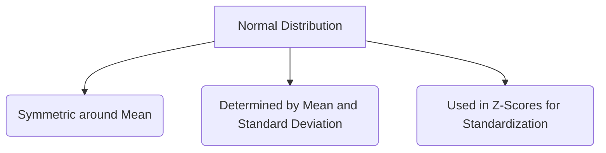

# Statistics & Probability (StatTrek Curriculum)

This handbook mirrors the exact curriculum from **StatTrek.com**, a definitive guide to foundational statistics, covering everything from basic data exploration to advanced hypothesis testing.

---

## 1. Exploring Data

Before applying complex algorithms, a Data Scientist must understand the raw data. 

### Categorical vs Quantitative Data
*   **Categorical:** Data that fits into groups (e.g., Eye color, Zip code).
*   **Quantitative:** Numerical data that can be measured (e.g., Height, Salary).

### Summarizing Data
*   **Central Tendency:** Mean (average), Median (middle value), Mode (most frequent).
*   **Variability:** Range, Variance, and Standard Deviation (how spread out the data is).
*   **Position:** Percentiles and Quartiles (used to create Box Plots).

```python
import numpy as np

data = [10, 12, 23, 23, 16, 23, 21, 16]
print(f"Mean: {np.mean(data)}")
print(f"Standard Deviation: {np.std(data):.2f}")
```

### Visualizing Data
We use Histograms for quantitative data and Bar Charts for categorical data. Scatterplots help visualize relationships between two quantitative variables.

---

## 2. Collecting Data (Sampling and Experiments)

A model is only as good as the data it trains on. If your sample is biased, your AI will be biased.

### Sampling Methods
*   **Simple Random Sample (SRS):** Every item has an equal chance of being selected. (The gold standard).
*   **Stratified Sampling:** Divide the population into groups (strata), then randomly sample from each group.
*   **Cluster Sampling:** Divide the population into clusters, randomly select a few clusters, and sample *everyone* in those clusters.

### Experimental Design
An experiment deliberately imposes a treatment on individuals to observe a response. To prove causation, an experiment must have:
1.  **Control:** A baseline group that receives no treatment or a placebo.
2.  **Randomization:** Subjects are assigned to treatments randomly.
3.  **Replication:** The experiment is performed on enough subjects to reduce chance variation.

---

## 3. Probability

Probability provides the mathematical framework for handling uncertainty.

### Rules of Probability
*   **The Rule of Subtraction:** The probability of an event NOT happening is 1 minus the probability that it DOES happen. $P(A^c) = 1 - P(A)$.
*   **The Rule of Multiplication:** The probability that Event A *and* Event B both happen. If they are independent: $P(A \cap B) = P(A) \times P(B)$.
*   **The Rule of Addition:** The probability that Event A *or* Event B happens. $P(A \cup B) = P(A) + P(B) - P(A \cap B)$.

### Bayes' Theorem
A powerful formula for updating probabilities based on new evidence.

---

## 4. Random Variables and Probability Distributions

A random variable assigns a numerical value to each possible outcome of an experiment.

### Discrete Distributions
Variables you can count (e.g., number of heads in 10 coin flips).
*   **Binomial Distribution:** Models the number of successes in a fixed number of binary trials.

### Continuous Distributions
Variables you can measure to infinite precision (e.g., exact height).
*   **Normal Distribution:** The famous Bell Curve. 
    *   68% of data falls within 1 Standard Deviation ($\sigma$) of the Mean ($\mu$).
    *   95% falls within 2 $\sigma$.
    *   99.7% falls within 3 $\sigma$.



---

## 5. Estimation (Confidence Intervals)

In the real world, we rarely have data for the entire population. We use a sample to *estimate* the population.

*   **Point Estimate:** A single number (e.g., the sample mean is 50).
*   **Confidence Interval:** A range of values (e.g., we are 95% confident the true population mean is between 45 and 55). 

The formula for a Confidence Interval relies on the **Standard Error** and a **Z-Score** (or T-Score) indicating the desired confidence level.

---

## 6. Hypothesis Testing

Hypothesis testing is how we mathematically prove if a result is statistically significant or just random noise.

### The Steps:
1.  **State the Hypotheses:** 
    *   Null Hypothesis ($H_0$): Nothing changed. The new medicine doesn't work.
    *   Alternative Hypothesis ($H_1$): The new medicine works better.
2.  **Formulate an Analysis Plan:** Decide on the significance level (usually $\alpha = 0.05$).
3.  **Analyze Sample Data:** Calculate the test statistic (Z-score, T-score, Chi-square).
4.  **Interpret Results:** Calculate the **P-Value**. If the P-Value is less than $\alpha$ (0.05), you reject the Null Hypothesis.

```python
from scipy import stats

# T-Test Example: Did Group B perform better than Group A?
group_a = [80, 85, 90, 92, 87]
group_b = [88, 92, 95, 94, 91]

t_stat, p_val = stats.ttest_ind(group_b, group_a)
if p_val < 0.05:
    print("Reject Null Hypothesis: Group B is statistically significantly better.")
```
