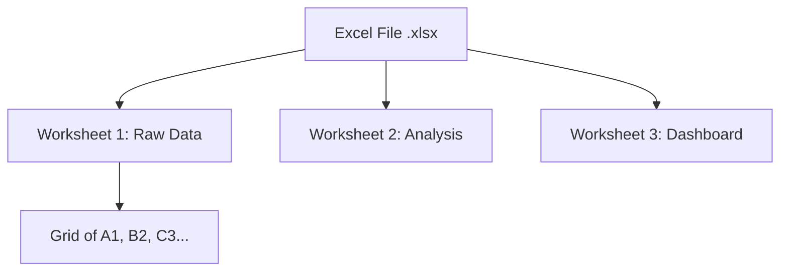
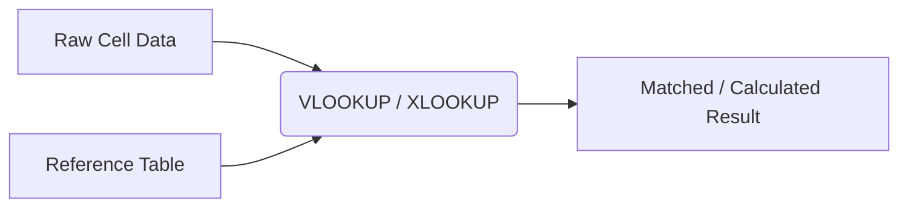
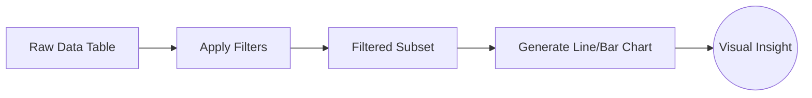
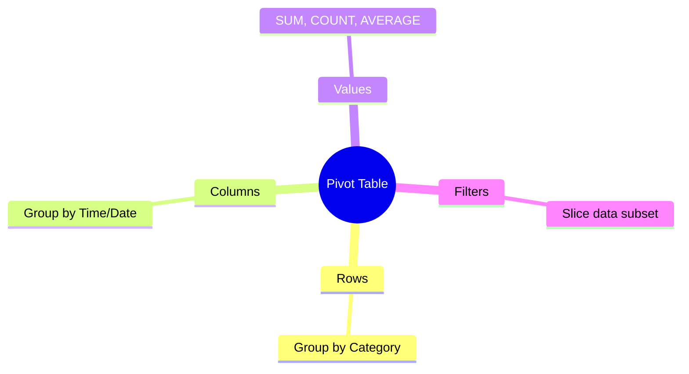

# Data Analytics with Excel - Inspired by Excel Easy

This document covers the essentials of using Microsoft Excel for data analytics, inspired by the practical approach of Excel Easy.

## 1. Basics: Ribbon, Workbook, and Worksheets

### Explanation
Excel organizes data into Workbooks (the file itself) which contain one or more Worksheets (the tabs at the bottom). The Ribbon at the top is the primary interface for accessing commands. Understanding this structure is fundamental before diving into analytics. Data is entered into cells, which are identified by their column letter and row number (e.g., `A1`). Efficient data entry, formatting, and navigation form the bedrock of Excel proficiency.

### Code Example
```vba
' VBA Macro to add a new worksheet and name it "Analytics"
Sub AddAnalyticsSheet()
    Dim ws As Worksheet
    Set ws = ThisWorkbook.Sheets.Add(After:=ThisWorkbook.Sheets(ThisWorkbook.Sheets.Count))
    ws.Name = "Analytics"
    ws.Range("A1").Value = "Data Source"
End Sub
```

### Diagram


---

## 2. Functions: Built-in Data Manipulation

### Explanation
Excel's real power lies in its built-in functions. Functions are predefined formulas that perform calculations using specific values (arguments) in a particular order. Crucial functions for analytics include logical functions (`IF`, `AND`, `OR`), lookup functions (`VLOOKUP`, `XLOOKUP`, `INDEX`, `MATCH`), and statistical functions (`AVERAGE`, `COUNTIF`, `SUMIFS`). These allow you to clean, transform, and derive new insights from raw data automatically.

### Code Example
```excel
=IF(B2>1000, "High Value", "Standard")
=VLOOKUP(A2, 'CustomerData'!A:D, 4, FALSE)
=SUMIFS(SalesColumn, RegionColumn, "North", DateColumn, ">"&DATE(2023,1,1))
```

### Diagram


---

## 3. Data Analysis: Sort, Filter, and Charts

### Explanation
Before complex modeling, you often need to explore the data visually and structurally. Sorting allows you to order data alphabetically or numerically. Filtering lets you hide rows that don't meet specific criteria, focusing your view on relevant subsets. Charts (like Bar, Line, Scatter, and Pie) turn tabular data into visual representations, making trends, outliers, and patterns immediately obvious to stakeholders.

### Code Example
```vba
' VBA Macro to apply a simple auto-filter
Sub ApplyFilter()
    ' Ensure filter mode is off first
    If ActiveSheet.AutoFilterMode = True Then ActiveSheet.AutoFilterMode = False
    
    ' Apply filter to Range A1:D100, filtering column 2 for values > 50
    Range("A1:D100").AutoFilter Field:=2, Criteria1:=">50"
End Sub
```

### Diagram


---

## 4. Pivot Tables

### Explanation
Pivot Tables are arguably Excel's most powerful analytical tool. They allow you to rapidly summarize, analyze, explore, and present summary data drawn from a larger dataset. With a few clicks, you can group data into categories, calculate sums, averages, or counts, and pivot the structure of your table (moving rows to columns and vice versa) to view the data from entirely different angles, all without writing a single complex formula.

### Code Example
```text
No code needed; Pivot Tables are UI-driven.
However, conceptual structure:
- Rows: 'Region'
- Columns: 'Year'
- Values: Sum of 'Revenue'
- Filters: 'Product Category'
```

### Diagram

