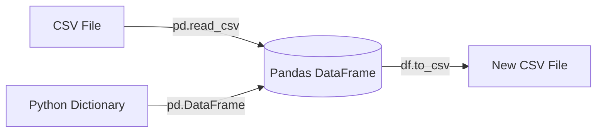
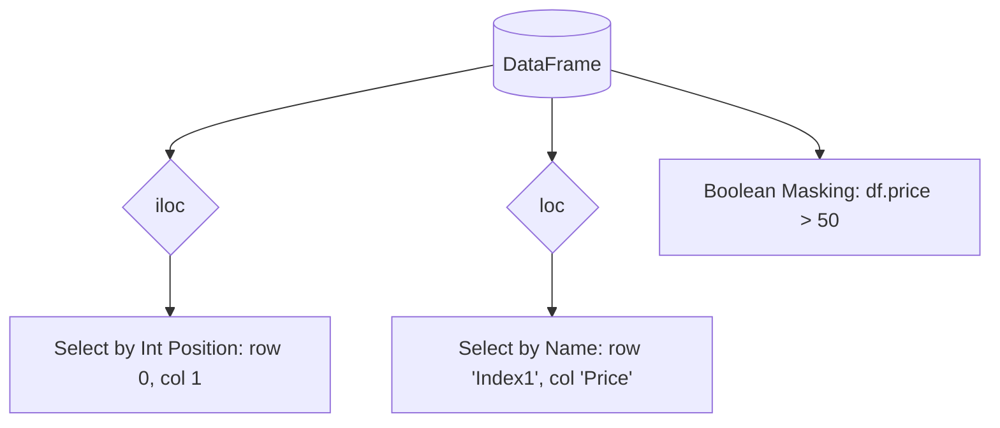

# Data Analytics with Python (Pandas) - Inspired by Kaggle

This document outlines the core concepts of using Python's Pandas library for data manipulation and analysis, following the Kaggle Pandas course structure.

## 1. Creating, Reading, and Writing Data

### Explanation
Pandas introduces two primary data structures: `Series` (1-dimensional) and `DataFrame` (2-dimensional, like a table). The first step in any Python data project is getting data into a DataFrame. Pandas excels at this, providing functions like `pd.read_csv()`, `pd.read_excel()`, and `pd.read_sql()` to ingest data from almost any source. Conversely, once analysis is complete, `to_csv()` or `to_excel()` allows you to export the modified DataFrame back to a file.

### Code Example
```python
import pandas as pd

# Creating a DataFrame from a dictionary
data = {'Apples': [30, 41], 'Bananas': [21, 34]}
df = pd.DataFrame(data, index=['2022', '2023'])

# Reading from a CSV file
# reviews = pd.read_csv("winemag-data-130k-v2.csv", index_col=0)

# Writing to a CSV file
df.to_csv("fruit_sales.csv")
```

### Diagram


---

## 2. Indexing, Selecting & Assigning

### Explanation
Selecting the specific data you want to analyze is critical. Pandas provides two main paradigms for selecting data: index-based selection and label-based selection. `iloc` is index-based, allowing you to select rows and columns by their integer position (e.g., `df.iloc[0:5, 1]`). `loc` is label-based, allowing you to select by row index names and column names (e.g., `df.loc[:, ['Apples', 'Bananas']]`). You can also use boolean masking to select rows based on conditions.

### Code Example
```python
import pandas as pd

# Assume 'reviews' DataFrame is loaded
# Select the first column
# first_column = reviews.iloc[:, 0]

# Select specific rows and columns by label
# subset = reviews.loc[0:9, ['country', 'variety']]

# Conditional selection (Boolean Masking)
# italian_wines = reviews.loc[reviews.country == 'Italy']
```

### Diagram


---

## 3. Grouping and Sorting

### Explanation
Similar to SQL's `GROUP BY`, Pandas uses the `groupby()` method to segment data into groups based on one or more columns. Once grouped, you can apply aggregation functions like `mean()`, `sum()`, `min()`, `max()`, or custom functions using `apply()`. After summarizing data, you often want to order it. The `sort_values()` method allows you to sort the DataFrame by the values in one or more columns, either ascending or descending.

### Code Example
```python
import pandas as pd

# Assume 'reviews' DataFrame is loaded
# Group by point score and count how many wines have that score
# points_count = reviews.groupby('points').points.count()

# Group by country, find the minimum and maximum price for each
# price_extremes = reviews.groupby('country').price.agg([min, max])

# Sort the extremes by the minimum price descending
# sorted_extremes = price_extremes.sort_values(by=['min'], ascending=False)
```

### Diagram
```mermaid
graph TD
    RawData[Raw DataFrame] --> GroupBy[groupby('Category')]
    GroupBy --> Agg[agg('mean')]
    Agg --> Sorted[sort_values()]
    Sorted --> Final[Analyzed Result]
```

---

## 4. Data Types and Missing Values

### Explanation
Knowing the data type (dtype) of your columns is vital, as it dictates what operations you can perform. Sometimes you need to change types using `astype()`. Real-world data is notoriously messy and often contains missing values (`NaN` in Pandas). Pandas provides robust methods to handle these: `pd.isnull()` or `isna()` to find them, `fillna()` to replace them with a specific value (like the mean or a placeholder), and `dropna()` to remove rows or columns containing missing data entirely.

### Code Example
```python
import pandas as pd
import numpy as np

df = pd.DataFrame({'A': [1, 2, np.nan], 'B': ['a', 'b', 'c']})

# Check data types
# print(df.dtypes)

# Convert column 'A' to float64
df['A'] = df['A'].astype('float64')

# Fill missing values in 'A' with the mean of column 'A'
df['A'] = df['A'].fillna(df['A'].mean())

# Alternatively, drop rows with any missing values
# clean_df = df.dropna()
```

### Diagram
```mermaid
flowchart LR
    DirtyData[DataFrame with NaNs] --> Check{Has NaNs?}
    Check -- Yes --> Strategy{Handling Strategy}
    Strategy -- Drop --> DropNA[dropna()]
    Strategy -- Impute --> FillNA[fillna(value)]
    DropNA --> CleanData[Clean DataFrame]
    FillNA --> CleanData
```
