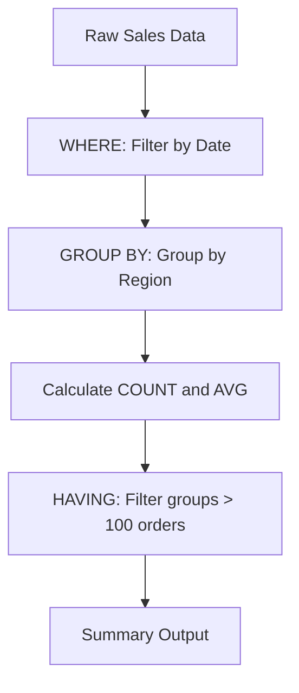
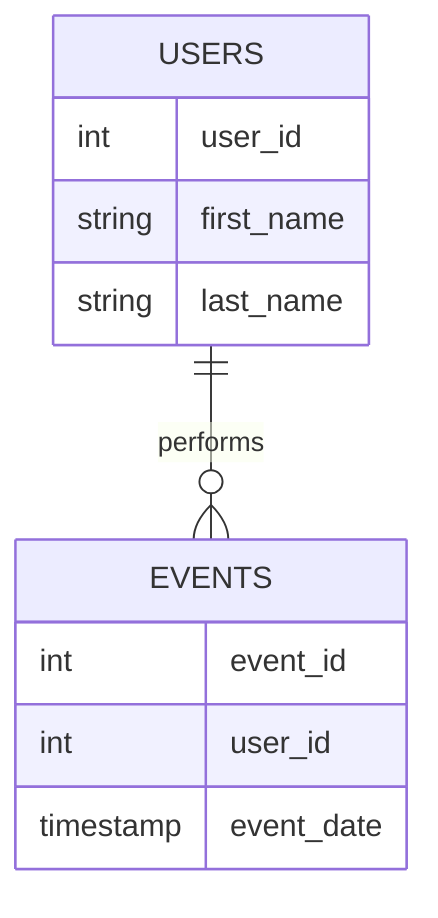
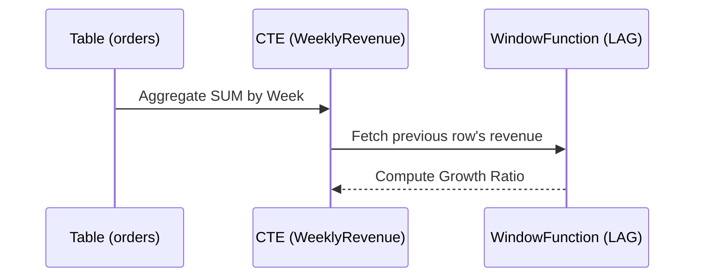

# Data Analytics with SQL - Inspired by Mode SQL Tutorial

This document covers SQL tailored specifically for data analysis, mirroring the structure of the Mode SQL Tutorial.

## 1. Basic SQL: Aggregation and Filtering

### Explanation
Data analysis often begins with summarizing massive datasets. Basic SQL analytics involves using aggregate functions (`COUNT`, `SUM`, `MIN`, `MAX`, `AVG`) combined with the `GROUP BY` clause. This allows you to collapse multiple rows into summary rows, calculating metrics per category. The `HAVING` clause is then used to filter the results of these aggregations, as `WHERE` cannot be used on aggregated columns.

### Code Example
```sql
-- Count total orders and calculate average order value per region
SELECT 
    region,
    COUNT(order_id) AS total_orders,
    AVG(order_amount) AS avg_order_value
FROM sales_data
WHERE order_date >= '2023-01-01'
GROUP BY region
HAVING COUNT(order_id) > 100
ORDER BY total_orders DESC;
```

### Diagram


---

## 2. Intermediate SQL: Joins and Data Types

### Explanation
Real-world data is rarely in a single table. Intermediate analytics requires mastering different types of joins (`INNER`, `LEFT`, `RIGHT`, `FULL OUTER`) to blend data from diverse sources. Furthermore, data often requires cleaning. Understanding data types and using SQL functions for string manipulation (e.g., `SUBSTRING`, `TRIM`, `CONCAT`), date/time parsing (e.g., `EXTRACT`, `DATE_TRUNC`), and type casting (e.g., `CAST(column AS datatype)`) are essential skills for preparing data for analysis.

### Code Example
```sql
-- Joining users with their activities and formatting dates
SELECT 
    u.user_id,
    CONCAT(u.first_name, ' ', u.last_name) AS full_name,
    DATE_TRUNC('month', e.event_date) AS activity_month,
    COUNT(e.event_id) as event_count
FROM users u
LEFT JOIN events e ON u.user_id = e.user_id
GROUP BY 1, 2, 3;
```

### Diagram


---

## 3. Advanced SQL: Subqueries and Window Functions

### Explanation
Advanced SQL analytics tackles complex questions that cannot be answered in a single pass. Subqueries (queries nested inside other queries) allow you to perform multi-step calculations, using the result of one query as a filter or input for another. Window functions (like `LEAD`, `LAG`, `RANK`, and running totals using `SUM() OVER()`) are crucial for time-series analysis, calculating week-over-week growth, and comparing individual rows to aggregate metrics without losing the individual row detail.

### Code Example
```sql
-- Calculating week-over-week revenue growth using LAG()
WITH WeeklyRevenue AS (
    SELECT 
        DATE_TRUNC('week', order_date) as week_start,
        SUM(revenue) as current_revenue
    FROM orders
    GROUP BY 1
)
SELECT 
    week_start,
    current_revenue,
    LAG(current_revenue, 1) OVER (ORDER BY week_start) as prev_revenue,
    (current_revenue - LAG(current_revenue, 1) OVER (ORDER BY week_start)) / 
        LAG(current_revenue, 1) OVER (ORDER BY week_start) as wow_growth
FROM WeeklyRevenue;
```

### Diagram

