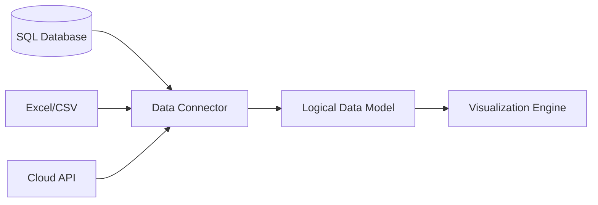
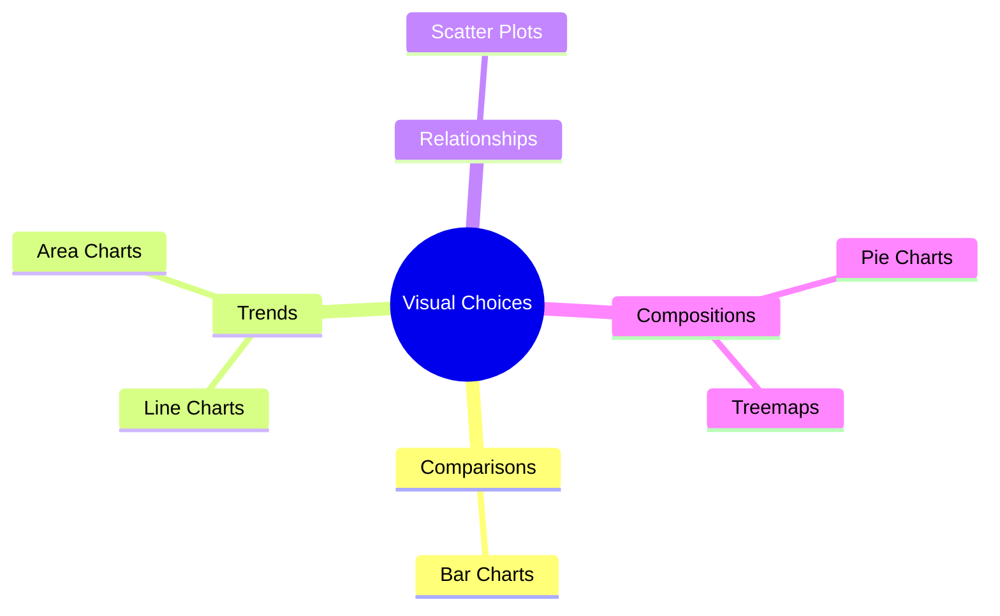
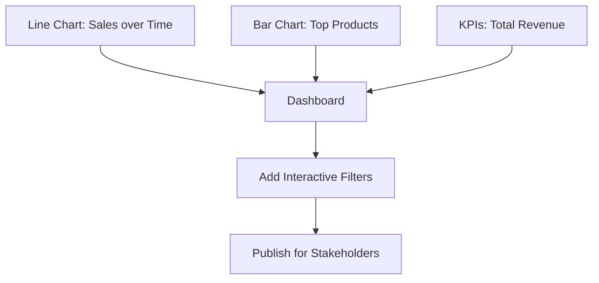
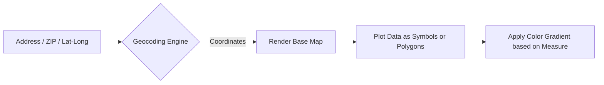

# Data Visualization - Inspired by Tableau Training

This document explores the principles of data visualization and business intelligence, structured similarly to standard Tableau Training modules.

## 1. Connecting to Data Sources

### Explanation
The foundation of any visualization tool is its connection to data. Modern BI tools can connect to almost anything: flat files (CSV, Excel), relational databases (SQL Server, PostgreSQL), cloud data warehouses (Snowflake, BigQuery), and web APIs. The connection phase involves not just linking the data, but also modeling it—defining relationships (joins/blends) between different tables, aliasing field names for clarity, and changing data types (e.g., ensuring a ZIP code is treated as a geographic string, not an integer).

### Code Example
```json
// Example of a metadata connection configuration (conceptual)
{
  "connection_type": "postgresql",
  "host": "db.internal.corp",
  "database": "sales_dw",
  "tables": [
    {
      "name": "fact_sales",
      "alias": "Sales Data"
    },
    {
      "name": "dim_geography",
      "alias": "Locations"
    }
  ],
  "joins": [
    {"left": "Sales Data.geo_id", "right": "Locations.id", "type": "inner"}
  ]
}
```

### Diagram


---

## 2. Visual Analytics (Building Charts)

### Explanation
Once connected, data is typically split into Dimensions (categorical data, like Region or Product Name) and Measures (quantitative, numerical data, like Sales or Profit). Visual analytics is the process of dragging and dropping these fields onto a canvas to create charts. Best practices dictate choosing the right chart for the question: line charts for trends over time, bar charts for comparisons across categories, and scatter plots for correlations between two measures. Colors, sizes, and labels are used to add further dimensions to a 2D chart.

### Code Example
```yaml
# Conceptual definition of a Bar Chart visualization
visualization:
  type: bar_chart
  x_axis: 
    field: "Product Category"
    type: "Dimension"
  y_axis:
    field: "Profit"
    type: "Measure"
    aggregation: "SUM"
  color_encoding:
    field: "Region"
  tooltips: ["Sales", "Profit Margin"]
```

### Diagram


---

## 3. Dashboards and Stories

### Explanation
A single chart rarely tells the whole story. A Dashboard is a collection of several related visualizations shown on a single page, designed to be viewed at a glance. Good dashboard design emphasizes layout, interactivity (using filters or actions where clicking one chart updates another), and clear, non-cluttered visuals. A "Story" takes this a step further by creating a guided, sequential narrative (like a slide presentation) using specific dashboard views to walk the audience through a specific analytical finding or recommendation.

### Code Example
```javascript
// Conceptual Dashboard layout configuration
const dashboardConfig = {
  title: "Q3 Executive Summary",
  filters: ["Global Region", "Date Range"],
  layout: [
    { component: "KPI_Banner", position: "Top", height: "10%" },
    { component: "Sales_Trend_Line", position: "Middle-Left", width: "60%" },
    { component: "Profit_by_Category_Bar", position: "Middle-Right", width: "40%" },
    { component: "Geographic_Map", position: "Bottom", height: "40%" }
  ]
};
```

### Diagram


---

## 4. Mapping and Geocoding

### Explanation
Geospatial analysis is a core feature of advanced visualization tools. If your data contains geographic fields (countries, states, cities, ZIP codes, or exact latitude/longitude coordinates), the tool can automatically generate maps. You can create symbol maps (where data points are represented by shapes of varying sizes/colors on specific coordinates) or filled maps (choropleths, where entire regions are colored based on a metric). This allows for rapid identification of regional performance or spatial concentrations.

### Code Example
```sql
-- SQL Query typically backing a geographic visualization
SELECT 
    state_province,
    country,
    SUM(sales_amount) as total_sales,
    COUNT(customer_id) as customer_density
FROM global_sales
WHERE year = 2023
GROUP BY state_province, country;
-- Tool translates 'state_province' and 'country' into map polygons
```

### Diagram

