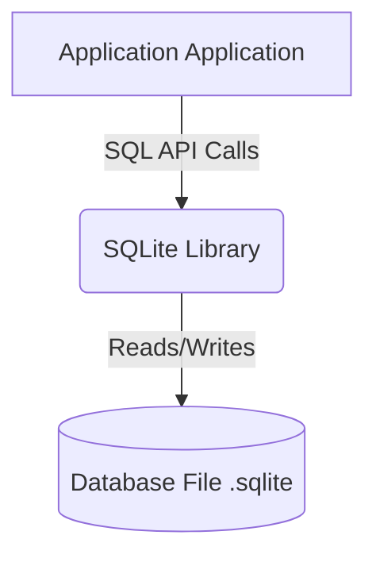
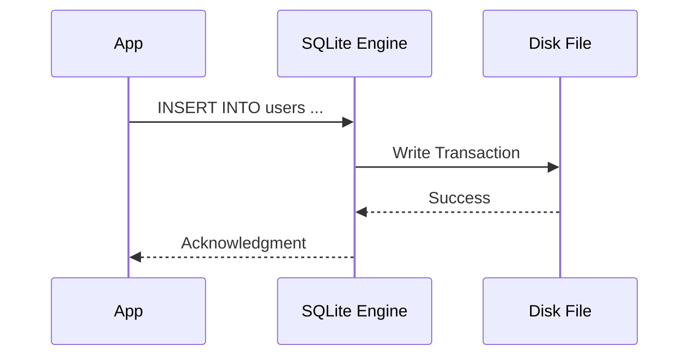
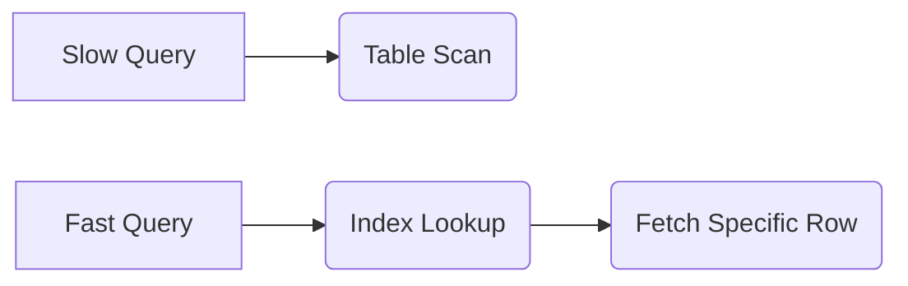

# SQLite Tutorial Roadmap

## 1. Introduction to SQLite and Creating Tables

SQLite is a C-language library that implements a small, fast, self-contained, high-reliability, full-featured, SQL database engine. Unlike most other SQL databases, SQLite does not have a separate server process. It reads and writes directly to ordinary disk files. The first step in database design is defining the schema using Data Definition Language (DDL). Creating tables involves defining column names, data types (like INTEGER, TEXT, REAL, BLOB), and constraints (like PRIMARY KEY or NOT NULL) to enforce data integrity.



```sql
-- Creating a basic table with constraints
CREATE TABLE users (
    user_id INTEGER PRIMARY KEY AUTOINCREMENT,
    username TEXT NOT NULL UNIQUE,
    email TEXT NOT NULL,
    created_at DATETIME DEFAULT CURRENT_TIMESTAMP
);

-- Creating a related table with a foreign key
CREATE TABLE posts (
    post_id INTEGER PRIMARY KEY AUTOINCREMENT,
    user_id INTEGER,
    content TEXT NOT NULL,
    FOREIGN KEY(user_id) REFERENCES users(user_id) ON DELETE CASCADE
);
```

## 2. Inserting and Updating Data

Data Manipulation Language (DML) is used to add, modify, or delete data within tables. The `INSERT INTO` statement adds new rows. You can insert a single row or multiple rows in one command. The `UPDATE` statement modifies existing data based on a `WHERE` clause. It is critical to always include a `WHERE` clause when updating (or deleting) data; otherwise, the change will be applied to every single row in the table, potentially ruining your dataset.



```sql
-- Inserting a single row
INSERT INTO users (username, email) 
VALUES ('alice123', 'alice@example.com');

-- Inserting multiple rows
INSERT INTO users (username, email) VALUES 
('bob_smith', 'bob@example.com'),
('charlie_d', 'charlie@example.com');

-- Updating an existing row safely
UPDATE users 
SET email = 'alice.new@example.com' 
WHERE username = 'alice123';
```

## 3. Querying Data with SELECT and JOINs

The `SELECT` statement is the most frequently used SQL command. It retrieves data from one or more tables. Data Query Language (DQL) allows for powerful filtering using `WHERE`, sorting with `ORDER BY`, and limiting results with `LIMIT`. Relational databases shine when combining data from multiple tables using `JOIN` operations. An `INNER JOIN` returns only the rows where there is a match in both tables, allowing you to reconstruct normalized data efficiently.

```mermaid
vennDiagram
    title INNER JOIN
    A(Table A) 
    B(Table B)
    Intersection(Matching rows returned)
```
*(Note: standard mermaid syntax diagram representing a relational join)*


```sql
-- Basic SELECT with filtering and sorting
SELECT username, email 
FROM users 
WHERE created_at >= '2023-01-01' 
ORDER BY username ASC;

-- INNER JOIN to fetch posts alongside their author's username
SELECT users.username, posts.content
FROM posts
INNER JOIN users ON posts.user_id = users.user_id
WHERE users.username = 'alice123';
```

## 4. Advanced SQLite Features (Indexes and Triggers)

As databases grow, query performance can degrade. Indexes are special lookup tables that the database search engine can use to speed up data retrieval. Think of them like the index at the back of a book. Triggers are database callbacks, which are automatically performed/executed when a specified database event (INSERT, UPDATE, DELETE) occurs on a particular table. They are useful for maintaining audit trails, validating complex data rules, or updating derived columns.



```sql
-- Creating an index on a frequently searched column
CREATE INDEX idx_users_email ON users(email);

-- Creating a trigger to log deletions
CREATE TABLE users_audit (
    audit_id INTEGER PRIMARY KEY AUTOINCREMENT,
    username TEXT,
    deleted_at DATETIME DEFAULT CURRENT_TIMESTAMP
);

CREATE TRIGGER after_user_delete
AFTER DELETE ON users
BEGIN
    INSERT INTO users_audit (username) 
    VALUES (old.username);
END;
```
