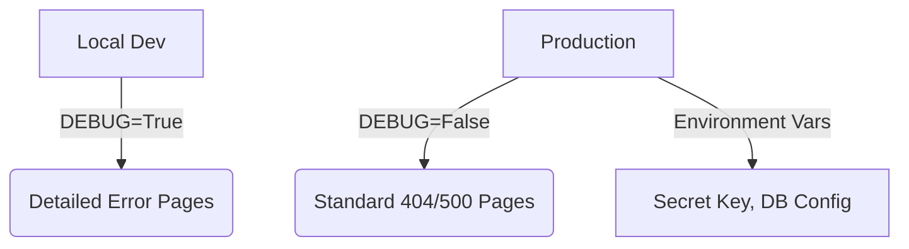
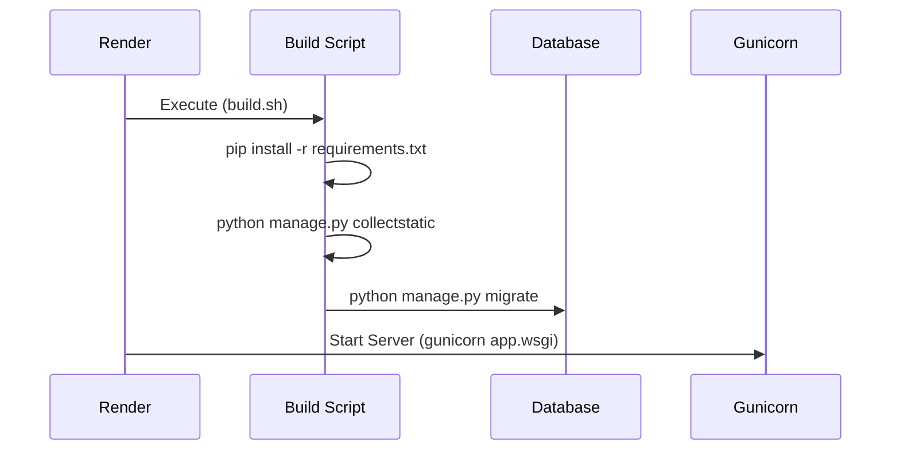
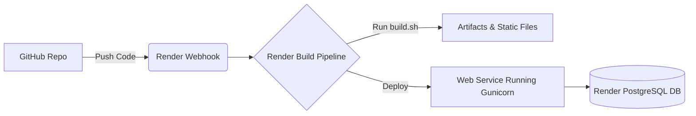

# Render Django Deployment Roadmap

## 1. Preparing Django for Production

Deploying a Django application to production requires several security and architectural changes from the local development environment. First, `DEBUG` must be set to `False` in `settings.py` to prevent sensitive error details from leaking to users. Second, `ALLOWED_HOSTS` must be updated to include the production domain name to prevent HTTP Host header attacks. Furthermore, sensitive credentials (like the `SECRET_KEY` and database URLs) should never be hardcoded in version control; they must be managed via environment variables using libraries like `python-environ` or `dj-database-url`.



```python
# settings.py snippets for production
import os
import dj_database_url

# SECURITY WARNING: don't run with debug turned on in production!
DEBUG = os.environ.get('DJANGO_DEBUG', '') != 'False'

# Ensure ALLOWED_HOSTS is configured
ALLOWED_HOSTS = ['your-app.onrender.com', 'localhost']

# Load DB config from environment variable provided by Render
DATABASES = {
    'default': dj_database_url.config(
        default='sqlite:///db.sqlite3',
        conn_max_age=600
    )
}
```

## 2. Creating the Build Script and WSGI

Render and similar Platform-as-a-Service (PaaS) providers need a way to build and run your application. A build script automates the installation of dependencies (via `pip`), applies database migrations, and collects static files so the web server can serve them efficiently. Django uses WSGI (Web Server Gateway Interface) to communicate with production web servers like Gunicorn. WhiteNoise is a middleware commonly added to Django projects to serve static files directly from the Python app, eliminating the need for a separate Nginx setup on simple deployments.



```bash
#!/usr/bin/env bash
# build.sh - Make sure to run `chmod a+x build.sh`
set -o errexit

pip install -r requirements.txt

python manage.py collectstatic --no-input
python manage.py migrate
```

```python
# settings.py configuring Whitenoise for static files
MIDDLEWARE = [
    'django.middleware.security.SecurityMiddleware',
    'whitenoise.middleware.WhiteNoiseMiddleware', # Add Whitenoise
    'django.contrib.sessions.middleware.SessionMiddleware',
    # ...
]

STATIC_ROOT = os.path.join(BASE_DIR, 'staticfiles')
```

## 3. Deploying on Render Environment

To deploy on Render, you connect your GitHub repository and define a Web Service. During setup, you specify the Build Command (e.g., `./build.sh`) and the Start Command (e.g., `gunicorn mysite.wsgi`). Render manages the infrastructure, automatically provisioning SSL certificates and scaling as needed. Setting up a managed PostgreSQL database on Render and linking its internal connection string to your Web Service via environment variables ensures a secure and highly performant backend for your Django application.



```yaml
# Optional render.yaml (Infrastructure as Code)
services:
  - type: web
    name: django-app
    env: python
    buildCommand: "./build.sh"
    startCommand: "gunicorn mysite.wsgi:application"
    envVars:
      - key: DATABASE_URL
        fromDatabase:
          name: django-db
          property: connectionString
      - key: PYTHON_VERSION
        value: 3.10.0

databases:
  - name: django-db
    databaseName: my_prod_db
    user: db_user
```
