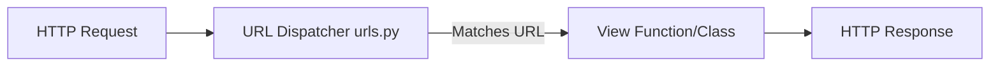
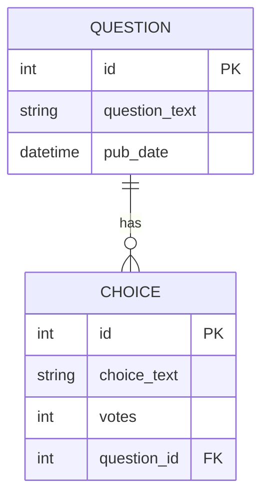
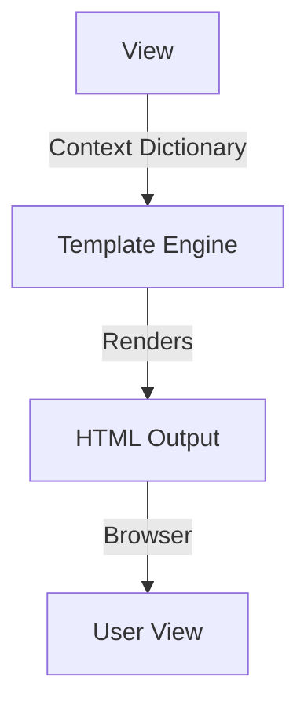
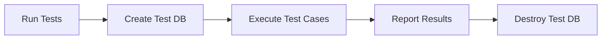

# Django Official Tutorial Roadmap

## 1. Project Setup and Views

Django is a high-level Python web framework that encourages rapid development and clean, pragmatic design. Setting up a Django project involves using the `django-admin startproject` command, which generates the foundational directory structure and configuration files (`settings.py`, `urls.py`, `manage.py`). Apps are sub-modules of a project, created with `python manage.py startapp`. A "View" in Django is a Python function or class that receives a web request and returns a web response. This response can be HTML, a redirect, or an error (like a 404).



```python
# views.py
from django.http import HttpResponse

def index(request):
    """A basic view that returns a simple string."""
    return HttpResponse("Hello, world. You're at the polls index.")

# urls.py
from django.urls import path
from . import views

urlpatterns = [
    path('', views.index, name='index'),
]
```

## 2. Models and Databases

Django provides an Object-Relational Mapping (ORM) layer, meaning you interact with your database using Python classes (Models) instead of writing raw SQL. Each model maps to a single database table, and each attribute represents a database field. Once you define your models, Django generates migration scripts (`python manage.py makemigrations`) that apply the schema changes to your actual database (`python manage.py migrate`). This abstracts away the complexity of database management and makes your application database-agnostic.



```python
# models.py
from django.db import models

class Question(models.Model):
    question_text = models.CharField(max_length=200)
    pub_date = models.DateTimeField('date published')

    def __str__(self):
        return self.question_text

class Choice(models.Model):
    question = models.ForeignKey(Question, on_delete=models.CASCADE)
    choice_text = models.CharField(max_length=200)
    votes = models.IntegerField(default=0)
```

## 3. Templates and Forms

Views shouldn't contain hardcoded HTML; they should delegate presentation to templates. Django's template engine allows you to inject Python variables and logic (like loops and if-statements) into HTML files securely. When a user submits data, Django forms handle data validation and cleaning. Forms can be defined in Python classes, which Django uses to automatically generate the necessary HTML `<input>` tags and to process POST requests, ensuring data integrity before saving to the database.



```html
<!-- template: detail.html -->
<h1>{{ question.question_text }}</h1>


    <p><strong>{{ error_message }}</strong></p>


<form action="" method="post">
    
    
        <input type="radio" name="choice" id="choice{{ forloop.counter }}" value="{{ choice.id }}">
        <label for="choice{{ forloop.counter }}">{{ choice.choice_text }}</label><br>
    
    <input type="submit" value="Vote">
</form>
```

## 4. Testing and Static Files

Automated testing is crucial for robust web applications. Django's test framework builds on Python's standard `unittest` library. You can write tests to simulate user requests, test views, check model methods, and verify template rendering without touching your production database (Django creates a temporary test DB). Static files—like images, JavaScript, and CSS—are managed separately from dynamic templates. The `django.contrib.staticfiles` app collects them from different apps into a single directory for production deployment.



```python
# tests.py
from django.test import TestCase
from django.utils import timezone
import datetime
from .models import Question

class QuestionModelTests(TestCase):
    def test_was_published_recently_with_future_question(self):
        """
        was_published_recently() returns False for questions whose pub_date
        is in the future.
        """
        time = timezone.now() + datetime.timedelta(days=30)
        future_question = Question(pub_date=time)
        self.assertIs(future_question.was_published_recently(), False)
```
