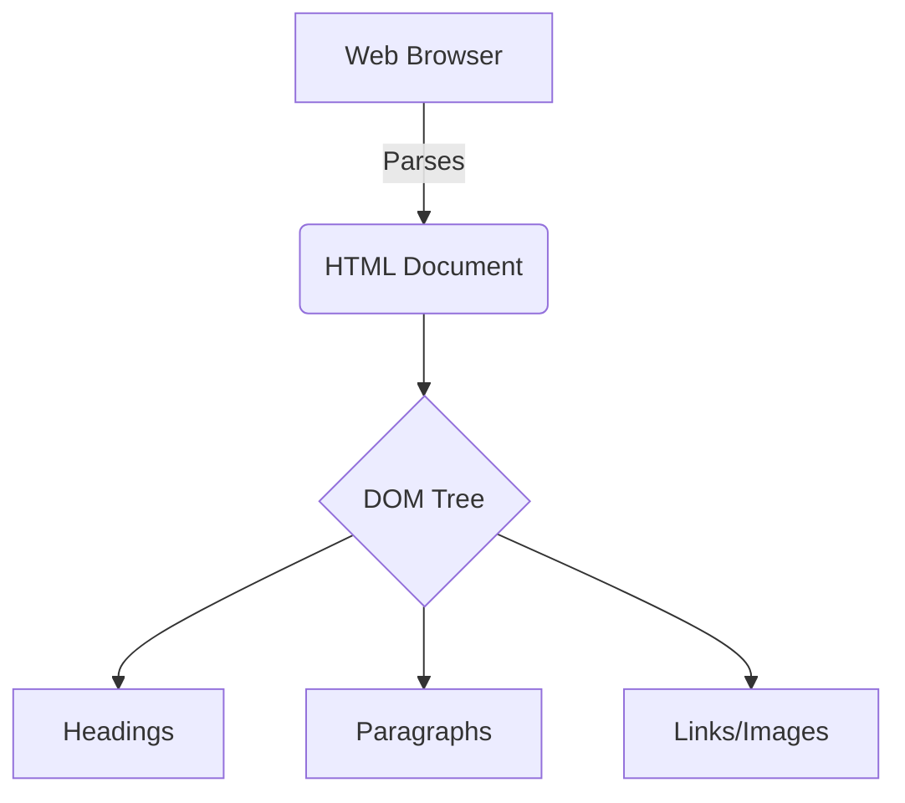
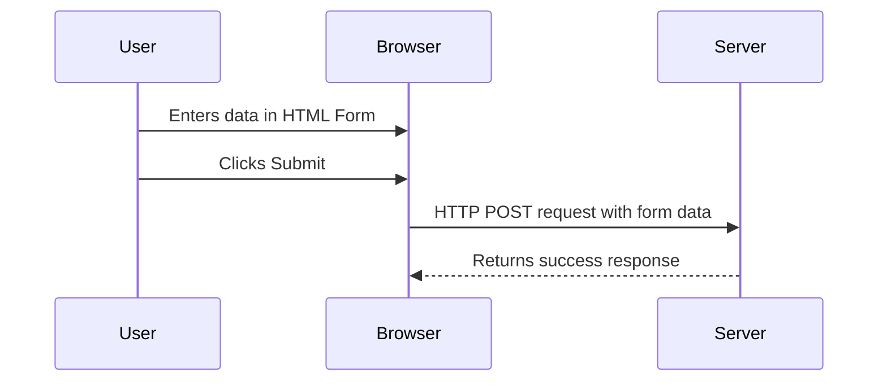
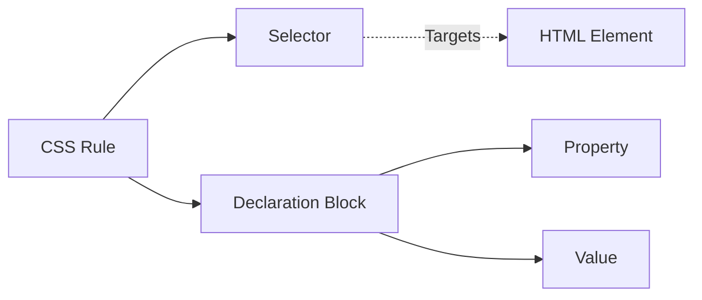
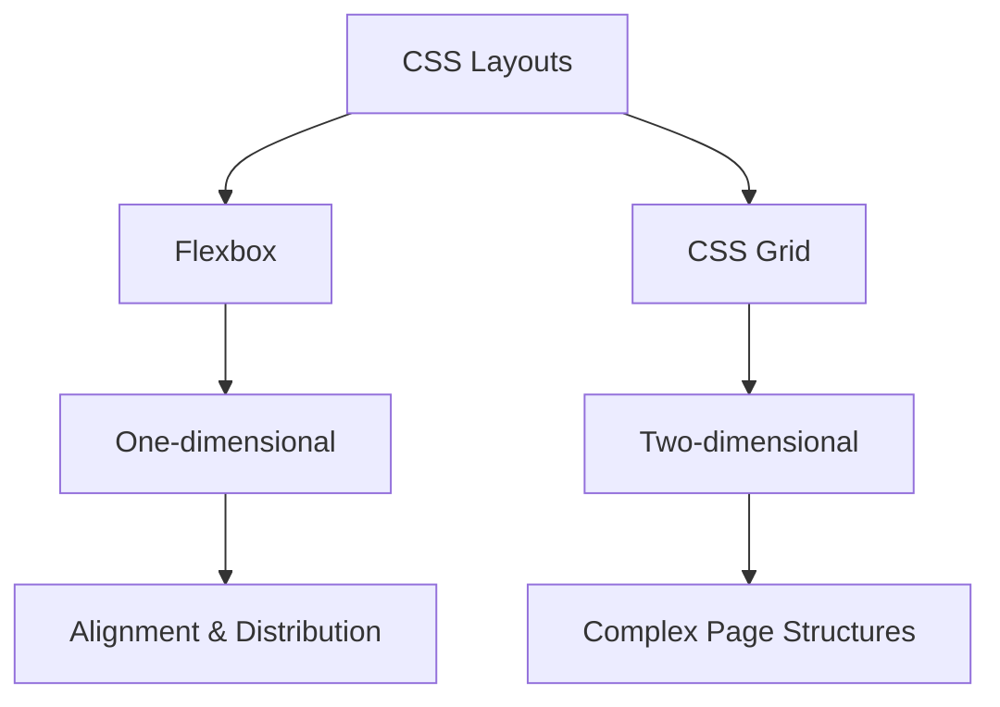

# MDN Web Docs HTML/CSS Roadmap

## 1. Introduction to the Web and HTML

HTML (HyperText Markup Language) is the most basic building block of the Web. It defines the meaning and structure of web content. Other technologies besides HTML are generally used to describe a web page's appearance/presentation (CSS) or functionality/behavior (JavaScript). HTML uses "elements" to annotate text, images, and other content for display in a Web browser. For beginners, it's essential to understand that HTML is not a programming language but a markup language. It tells the browser what each part of the document is (e.g., a heading, a paragraph, a link).



```html
<!DOCTYPE html>
<html lang="en">
<head>
    <meta charset="UTF-8">
    <title>My First Webpage</title>
</head>
<body>
    <h1>Welcome to Web Development</h1>
    <p>This is a beginner's guide to HTML.</p>
    <a href="https://developer.mozilla.org">MDN Web Docs</a>
</body>
</html>
```

## 2. HTML Forms and Multimedia

Forms are the primary method for gathering user input on the web. They are used for logging in, registering, searching, and much more. An HTML form is comprised of the `<form>` element, which encapsulates various input controls like text fields, checkboxes, radio buttons, and submit buttons. Multimedia elements like ``, `<audio>`, and `<video>` allow you to embed rich media directly into your web pages, transforming them from static text documents into interactive experiences. Understanding how to label inputs properly is also critical for accessibility.



```html
<form action="/submit-data" method="POST">
    <label for="username">Username:</label>
    <input type="text" id="username" name="username" required>
    
    <label for="profile_pic">Profile Picture:</label>
    <input type="file" id="profile_pic" name="profile_pic" accept="image/png, image/jpeg">
    
    <button type="submit">Register</button>
</form>

<video controls width="500">
    <source src="tutorial.mp4" type="video/mp4">
    Your browser does not support the video tag.
</video>
```

## 3. CSS Styling Basics

CSS (Cascading Style Sheets) is the language we use to style an HTML document. CSS describes how HTML elements should be displayed on screen, paper, or in other media. The core concept of CSS is the "selector," which targets HTML elements, and a "declaration block," which contains styling properties and values. The "cascade" determines which rules apply when multiple rules target the same element, based on specificity and inheritance. The Box Model is fundamental to CSS, dictating how elements are sized and spaced using margins, borders, padding, and the actual content area.



```css
/* Selects all paragraphs */
p {
    color: #333333;
    font-size: 16px;
    line-height: 1.5;
}

/* Class selector with Box Model properties */
.card {
    background-color: white;
    padding: 20px; /* Space inside the border */
    border: 1px solid #cccccc;
    margin-bottom: 15px; /* Space outside the border */
    border-radius: 8px; /* Rounded corners */
}
```

## 4. CSS Layouts (Flexbox and Grid)

Modern CSS provides powerful layout modules: Flexbox and CSS Grid. Flexbox (Flexible Box Layout) is designed for one-dimensional layouts, meaning it organizes items either in a row or a column. It excels at distributing space and aligning items within a container. CSS Grid Layout is a two-dimensional system, handling both columns and rows simultaneously, allowing for complex and responsive web designs without relying on hacks like floats. Mastering both is essential for modern frontend development.



```css
/* Flexbox Example */
.nav-bar {
    display: flex;
    justify-content: space-between;
    align-items: center;
    background-color: #007bff;
    color: white;
    padding: 10px 20px;
}

/* CSS Grid Example */
.grid-container {
    display: grid;
    grid-template-columns: repeat(3, 1fr); /* 3 equal columns */
    gap: 20px; /* Space between grid items */
}

.grid-item {
    background: #f4f4f4;
    padding: 20px;
    text-align: center;
}
```
