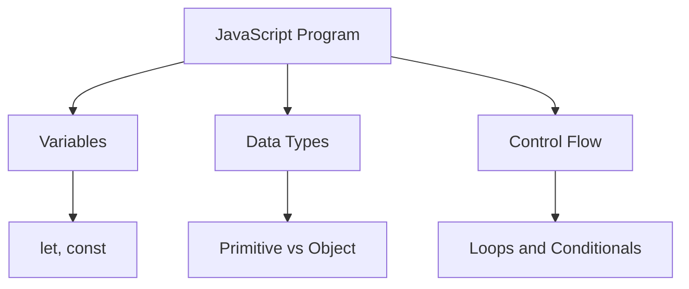
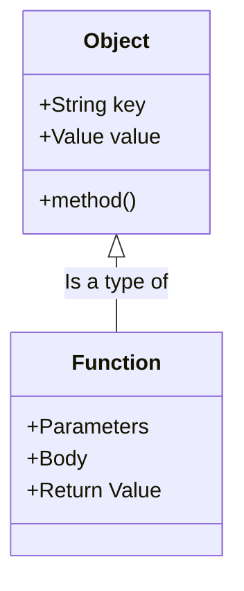
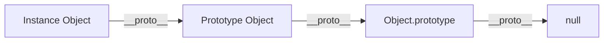
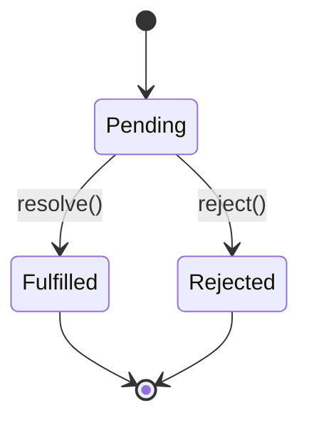
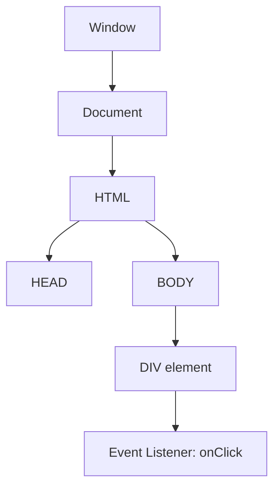

# Javascript.info Roadmap

## 1. JavaScript Fundamentals

JavaScript is a versatile, high-level programming language that powers the dynamic behavior of web pages. Beginners must grasp fundamentals like variables (`let`, `const`, `var`), data types (numbers, strings, booleans, null, undefined, symbols, and objects), and basic operators. Control flow structures, such as `if/else` statements and `for/while` loops, direct the execution path of the code. A strong understanding of these basics is critical before moving on to more complex features like functions and objects. Remember that `let` and `const` are block-scoped, whereas `var` is function-scoped.



```javascript
// Variable declarations
const maxUsers = 100;
let currentUsers = 0;

// Conditionals and Loops
for(let i = 0; i < 5; i++) {
    currentUsers++;
    if (currentUsers >= maxUsers) {
        console.log("Server full!");
        break;
    }
}
console.log(`Current users: ${currentUsers}`);
```

## 2. Objects and Functions

Objects are the core data structure in JavaScript, used to store keyed collections of various data and more complex entities. They are created using curly braces `{}`. Functions are a type of object, meaning they can be passed as arguments, returned from other functions, and assigned to variables (first-class citizens). Understanding how `this` behaves within object methods versus arrow functions is a common stumbling block for beginners. Arrow functions inherit `this` from their enclosing lexical context, making them very useful for callbacks.



```javascript
// Object literal with methods
const user = {
    name: "Alice",
    age: 25,
    greet() {
        console.log(`Hello, my name is ${this.name}`);
    }
};

// Arrow function example
const add = (a, b) => a + b;

user.greet();
console.log(add(5, 10));
```

## 3. Prototypes and Classes

Unlike classical object-oriented languages (like Java or C++), JavaScript uses prototypal inheritance. Every object in JavaScript has a hidden internal property called `[[Prototype]]` that points to another object (or null). When you try to access a property that doesn't exist on an object, JavaScript looks up the prototype chain. The `class` syntax introduced in ES6 provides a much cleaner, more familiar syntactic sugar over this prototypal inheritance, allowing developers to define constructor functions and methods more elegantly.



```javascript
// ES6 Class syntax
class Animal {
    constructor(name) {
        this.name = name;
    }
    speak() {
        console.log(`${this.name} makes a noise.`);
    }
}

class Dog extends Animal {
    speak() {
        console.log(`${this.name} barks.`);
    }
}

const d = new Dog('Rex');
d.speak(); // Rex barks.
```

## 4. Promises and Async/Await

Asynchronous programming is vital in JavaScript, especially for web development where operations like fetching data from an API take time. Promises represent the eventual completion (or failure) of an asynchronous operation and its resulting value. They solve the problem of "callback hell." The `async/await` syntax, introduced in ES2017, builds on top of Promises, allowing you to write asynchronous code that looks and behaves like synchronous code, making it much easier to read and maintain.



```javascript
// Using async/await
async function fetchUserData(userId) {
    try {
        // Awaits the promise to resolve
        const response = await fetch(`https://api.example.com/users/${userId}`);
        if (!response.ok) {
            throw new Error('Network response was not ok');
        }
        const data = await response.json();
        console.log(data);
    } catch (error) {
        console.error('Fetch failed:', error);
    }
}

fetchUserData(1);
```

## 5. DOM Manipulation and Events

The Document Object Model (DOM) is an object-oriented representation of the web page, which can be modified with JavaScript. It allows you to dynamically change the document's structure, style, and content. Events are actions or occurrences that happen in the system you are programming, which the system tells you about so you can respond to them. By attaching event listeners to DOM elements (like a button click or a form submission), you can execute JavaScript code interactively based on user actions.



```javascript
// Accessing DOM elements and adding event listeners
document.addEventListener('DOMContentLoaded', () => {
    const button = document.getElementById('myButton');
    const displayArea = document.querySelector('.display');

    button.addEventListener('click', (event) => {
        // Manipulating the DOM
        displayArea.textContent = 'Button was clicked!';
        displayArea.style.color = 'green';
    });
});
```
