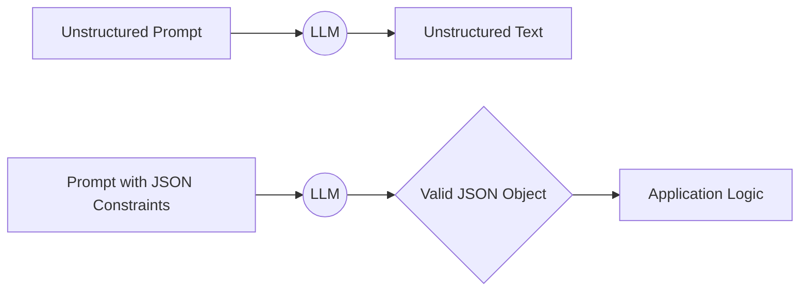
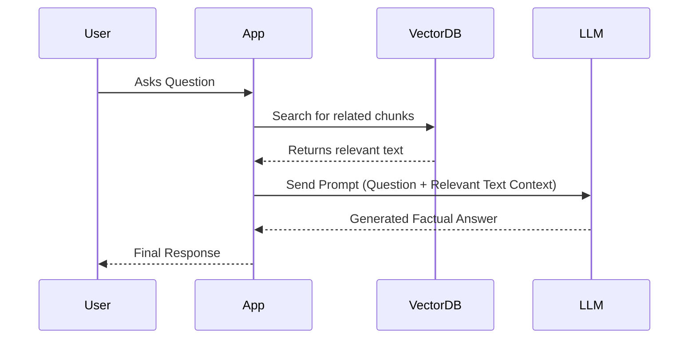
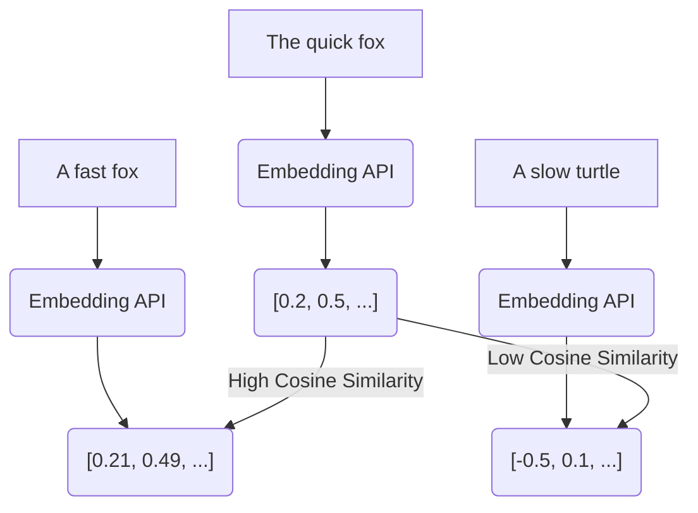
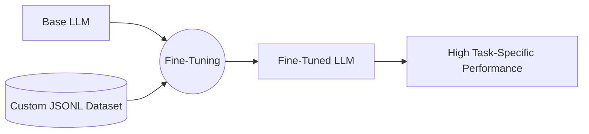

# Advanced Prompt Engineering (OpenAI Cookbook)

## Table of Contents
1. Text Generation and Formatting
2. Retrieval-Augmented Generation (RAG)
3. Function Calling / Tool Use
4. Embeddings and Semantic Search
5. Fine-Tuning Basics

## 1. Text Generation and Formatting

Advanced text generation goes beyond simple Q&A. It involves forcing the LLM to output structured data like JSON, Markdown, or specific code syntaxes. This is critical when integrating LLMs into software pipelines where the output needs to be parsed programmatically.

Techniques include providing strict formatting instructions, using few-shot examples that demonstrate the exact desired output structure, and utilizing API features like `response_format={ "type": "json_object" }` (in OpenAI's API) to guarantee JSON compliance.

```python
import json

# Forcing JSON output via prompting
prompt = """
Provide details about the planet Mars.
You must respond strictly in JSON format with keys: 'name', 'color', 'moons' (list).
"""
# Assuming model output is stored in `response_text`
response_text = '{"name": "Mars", "color": "Red", "moons": ["Phobos", "Deimos"]}'
parsed_data = json.loads(response_text)
print(parsed_data["moons"])
```



## 2. Retrieval-Augmented Generation (RAG)

LLMs suffer from hallucinations and knowledge cutoffs. RAG solves this by grounding the model in external knowledge. Instead of asking the LLM to answer from memory, you first search a database for relevant documents, then provide those documents to the LLM as context in the prompt.

This ensures the model answers based on factual, up-to-date, or proprietary information. The workflow involves indexing data, embedding it, querying the database, and finally synthesizing the answer.

```python
# Simplified RAG Prompting Flow
retrieved_documents = [
    "Company policy states remote work is allowed on Fridays.",
    "Core hours are 10 AM to 3 PM."
]
context = "\n".join(retrieved_documents)
user_query = "Can I work from home on Friday at 9 AM?"

rag_prompt = f"""
Answer the user's question using ONLY the provided context. If the answer is not in the context, say "I don't know."

Context:
{context}

Question: {user_query}
"""
```



## 3. Function Calling / Tool Use

Function calling allows LLMs to interact with the outside world. Instead of just returning text, the model can suggest calling a specific function in your code with specific arguments. This bridges the gap between text generation and executing actions (like fetching weather, querying an API, or sending an email).

You define a schema of available tools, pass it to the model, and the model intelligently decides if and how to use them based on the user's prompt.

```python
# Defining a tool schema for the LLM
tools = [
  {
    "type": "function",
    "function": {
      "name": "get_current_weather",
      "description": "Get the current weather in a given location",
      "parameters": {
        "type": "object",
        "properties": {
          "location": {"type": "string", "description": "The city and state, e.g. San Francisco, CA"}
        },
        "required": ["location"]
      }
    }
  }
]
# The model will output a JSON indicating it wants to call 'get_current_weather' with location='San Francisco'
```

```mermaid
flowchart TD
    User(User Prompt: 'Weather in Tokyo?') --> LLM((LLM))
    LLM -- Recognizes need for tool --> ToolSchema[Check Available Tools]
    ToolSchema --> JSONOut[Outputs Tool Call JSON: get_weather('Tokyo')]
    JSONOut --> AppExec(App Executes Function)
    AppExec --> Result[Result: 'Sunny, 25C']
    Result --> LLM2((LLM Synthesizes Result))
    LLM2 --> Final[Final Text: 'It is currently sunny and 25C in Tokyo.']
```

## 4. Embeddings and Semantic Search

Embeddings convert text into dense vectors of numbers. Words or sentences with similar meanings end up close together in this mathematical space. This is the foundation of semantic search—finding information based on meaning rather than exact keyword matches.

By embedding your documents and the user's query, you can compute the cosine similarity between them to find the most relevant pieces of information, which is a crucial step in the RAG pipeline.

```python
# Concept of calculating similarity (using pseudo-code for clarity)
import numpy as np

def cosine_similarity(vec1, vec2):
    return np.dot(vec1, vec2) / (np.linalg.norm(vec1) * np.linalg.norm(vec2))

# Hypothetical embeddings returned by an API
embed_query = [0.1, 0.3, 0.5] # "dog"
embed_doc1 = [0.12, 0.31, 0.48] # "puppy" (highly similar)
embed_doc2 = [0.8, -0.2, 0.1] # "car" (not similar)

print(cosine_similarity(embed_query, embed_doc1)) # ~0.99
```



## 5. Fine-Tuning Basics

When prompt engineering and RAG aren't enough—perhaps you need the model to learn a highly specific tone, a proprietary coding language, or a complex classification system—you can use fine-tuning. 

Fine-tuning involves training the model further on a custom dataset of prompt-completion pairs. It alters the underlying weights of the model, making it naturally adept at your specific task without needing extensive instructions in the prompt every time.

```python
# Example of a JSONL dataset format used for fine-tuning
dataset = [
  {"messages": [{"role": "system", "content": "You are a sarcastic assistant."}, {"role": "user", "content": "What time is it?"}, {"role": "assistant", "content": "Time for you to buy a watch."}]},
  {"messages": [{"role": "system", "content": "You are a sarcastic assistant."}, {"role": "user", "content": "Is it raining?"}, {"role": "assistant", "content": "Look out the window, genius."}]}
]
# This dataset is uploaded via an API to initiate a fine-tuning job.
```


