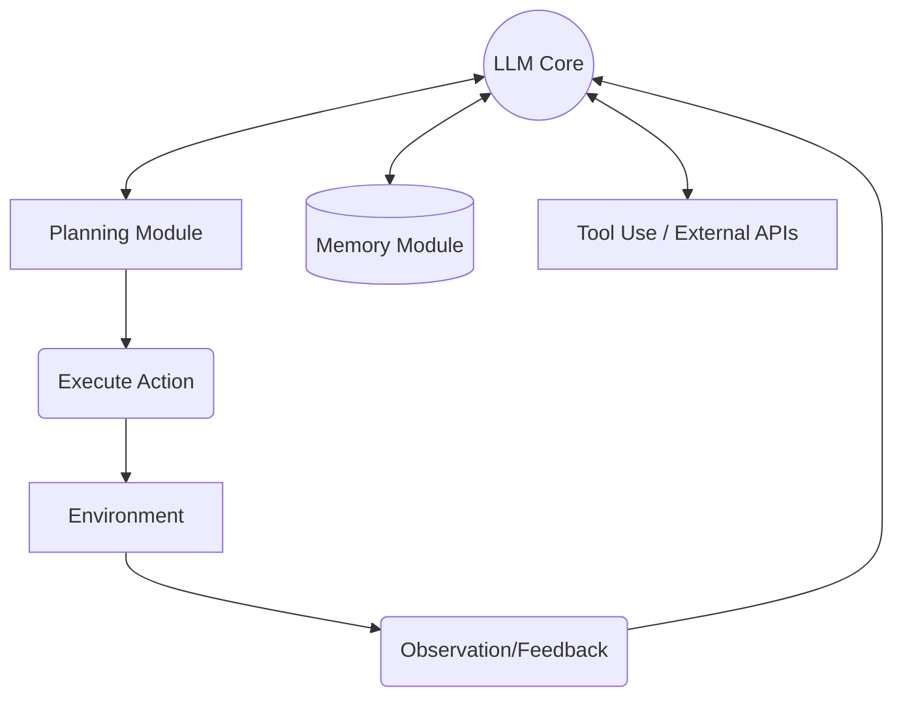
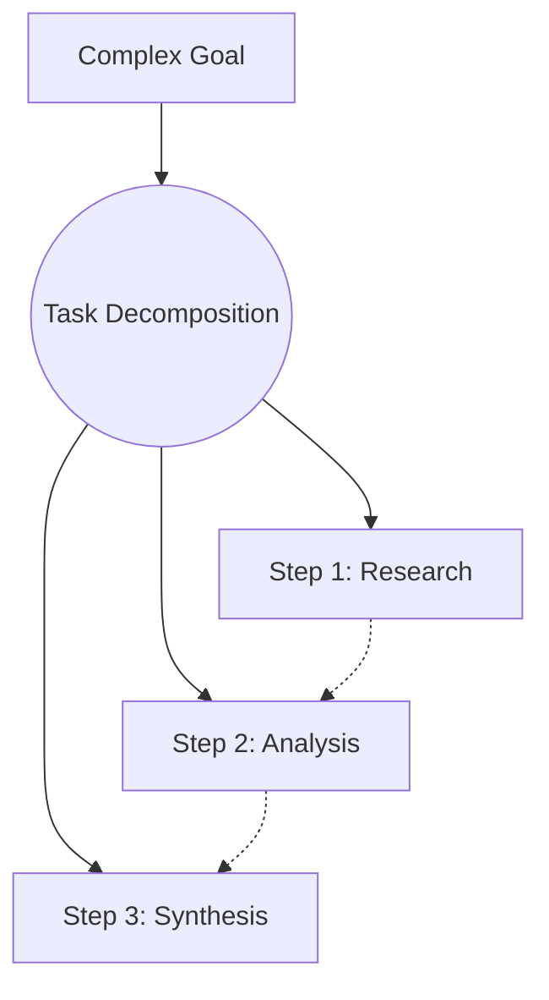
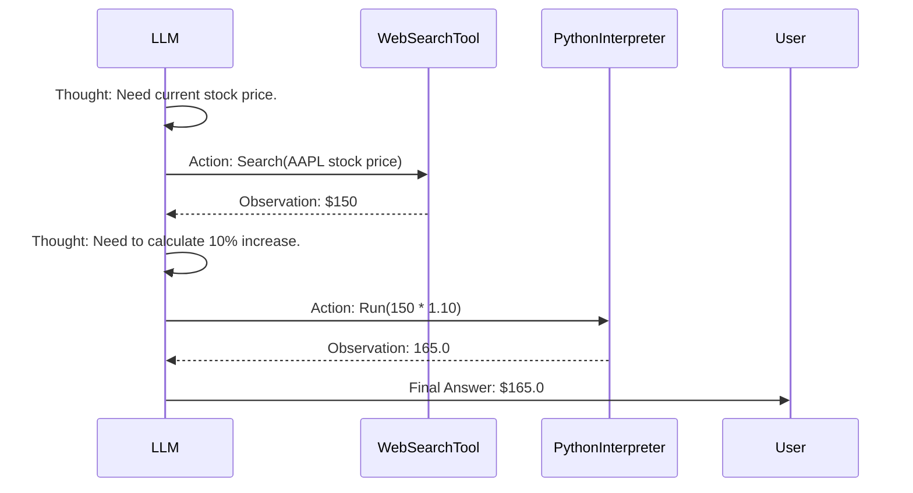
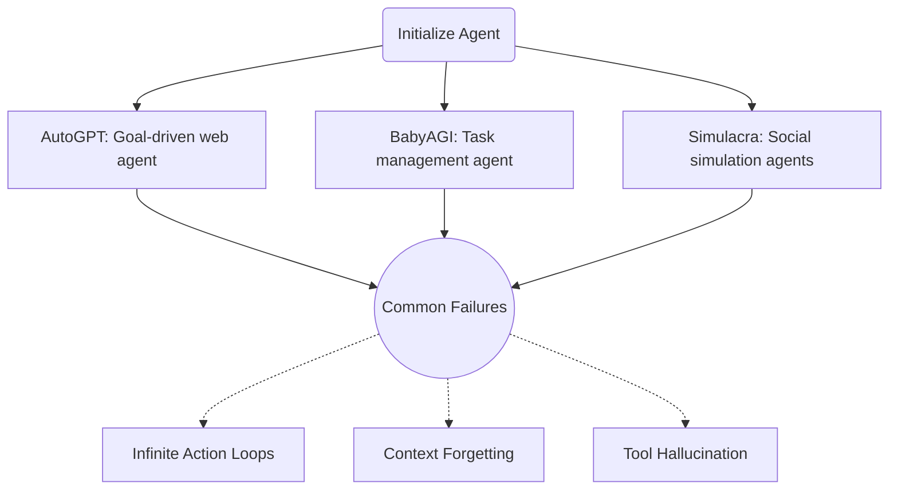

# LLM Powered Autonomous Agents (Lilian Weng)

## Table of Contents
1. Agent System Overview
2. Component One: Planning
3. Component Two: Memory
4. Component Three: Tool Use
5. Case Studies

## 1. Agent System Overview

An autonomous agent goes beyond a standard chat interface. It uses an LLM as its core "brain" to understand goals, reason about steps, interact with its environment, and execute tasks autonomously. Instead of just answering a question, an agent is given an objective and left to accomplish it through a loop of observation, reasoning, and action.

The architecture of such an agent typically comprises three main components: Planning (breaking down tasks), Memory (remembering past actions and facts), and Tool Use (interacting with external APIs or environments).

```python
# Pseudo-code for an agent's main loop
class AutonomousAgent:
    def execute_goal(self, goal):
        memory = []
        while not self.is_goal_achieved():
            plan = self.llm_plan(goal, memory)
            action = self.select_action(plan)
            observation = action.execute()
            memory.append({"action": action, "result": observation})
            self.evaluate_progress(observation)
```



## 2. Component One: Planning

Planning involves breaking down complex goals into manageable, sequential steps. This is crucial for agents, as LLMs struggle to solve multi-step problems in a single pass. Techniques like Task Decomposition allow the agent to create a roadmap.

Advanced planning methods include Chain of Thought (CoT), where the model thinks step-by-step, and Tree of Thoughts (ToT), where the model explores multiple possible plans simultaneously, evaluating and pruning paths that look unpromising. Another technique is Self-Reflection, where the agent critiques its own past actions to improve future steps.

```python
# Task Decomposition Prompt
decomposition_prompt = """
Goal: Write a comprehensive report on the impact of AI in healthcare.

Decompose this goal into 3 to 5 sequential, actionable steps.
"""
# The LLM will output a list like: 1. Research literature. 2. Outline report. 3. Draft sections. etc.
```



## 3. Component Two: Memory

Memory gives an agent context over time. It is divided into Short-term memory (in-context learning within the current chat session's token limit) and Long-term memory (persistent storage of information across sessions).

Long-term memory is typically implemented using Vector Databases. The agent embeds its experiences or facts and stores them. When facing a new situation, it performs a semantic search to retrieve relevant past experiences, providing the LLM context that exceeds its standard context window.

```python
# Concept of storing and retrieving memory
def store_memory(vector_db, text_experience):
    embedding = generate_embedding(text_experience)
    vector_db.insert(embedding, text_experience)

def retrieve_memory(vector_db, current_situation):
    query_embedding = generate_embedding(current_situation)
    relevant_past = vector_db.search_similar(query_embedding)
    return relevant_past
```

```mermaid
cylinder title Memory Architecture
    "Short-Term Memory" : "Current Prompt Context Window"
    "Long-Term Memory" : "External Vector Database"

flowchart LR
    CurrentEvent[New Observation] --> Embed(Embedding Model)
    Embed --> Query[(Vector DB)]
    Query --> Retrieved[Relevant Past Memories]
    Retrieved --> LLM((LLM Context))
```

## 4. Component Three: Tool Use

LLMs are inherently constrained by their training data and lack of real-time access. Tool use equips them with "hands." By defining APIs (calculators, web searchers, code interpreters) as tools, the agent can call these functions when it realizes it needs external help.

Frameworks like ReAct (Reasoning and Acting) structure this process: the model thinks about what to do, takes an action using a tool, observes the result, and then reasons about the next step.

```python
# ReAct Prompt Structure Example
react_prompt = """
Question: What is the square root of the population of Canada?

Thought 1: I need to find the population of Canada first.
Action 1: Search[population of Canada]
Observation 1: 38 million.
Thought 2: Now I need to calculate the square root of 38,000,000.
Action 2: Calculator[sqrt(38000000)]
Observation 2: 6164.41
Thought 3: I have the final answer.
Final Answer: 6164.41
"""
```



## 5. Case Studies

Examining real-world implementations of autonomous agents helps understand their capabilities and limitations. Examples like AutoGPT, BabyAGI, and generative simulation agents (like the Stanford Smallville paper) demonstrate how these components interact.

These case studies reveal common challenges, such as agents getting stuck in infinite loops, hallucinating tool responses, or losing track of the original goal due to memory limitations or context window overflow.

```python
# A simple simulation of an agent getting stuck in a loop (a common failure case)
def failing_agent_loop():
    action = "Search for X"
    observation = "X not found, try searching for Y"
    # Agent might misinterpret and search for X again instead of Y
    action2 = "Search for X" 
    # This loop requires robust self-reflection to break.
```


