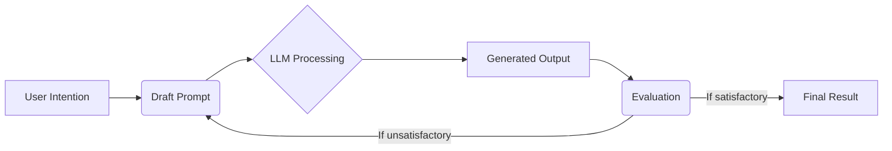
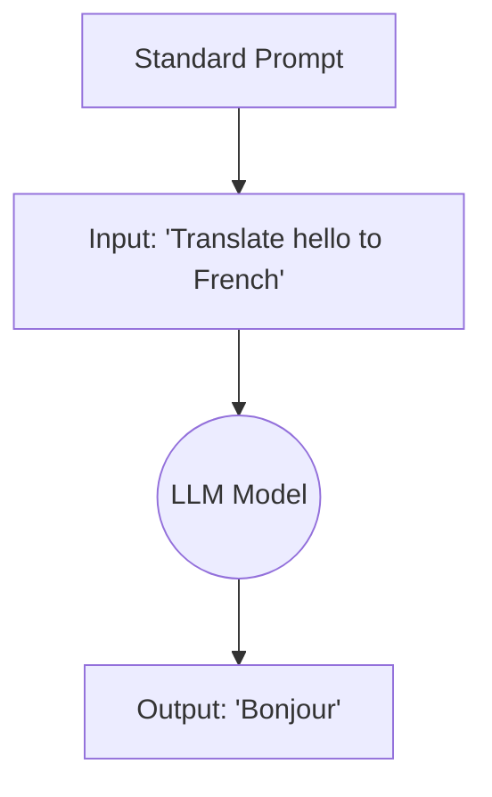
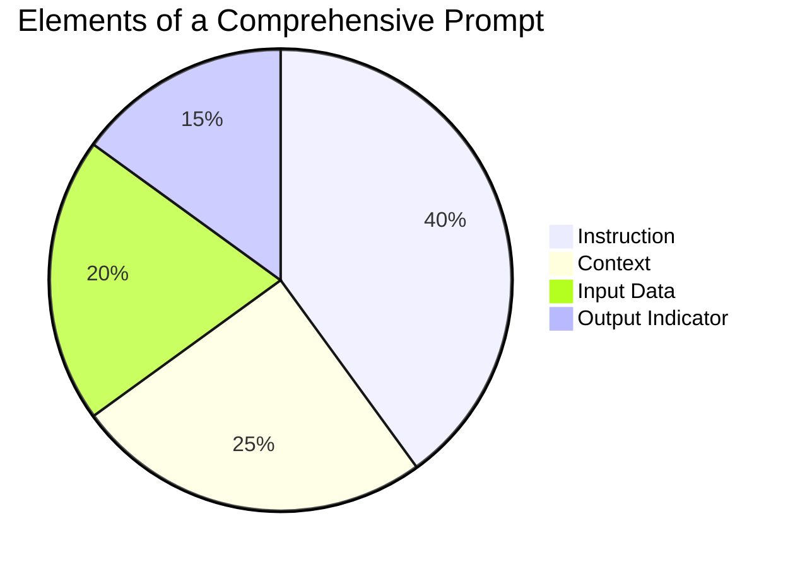
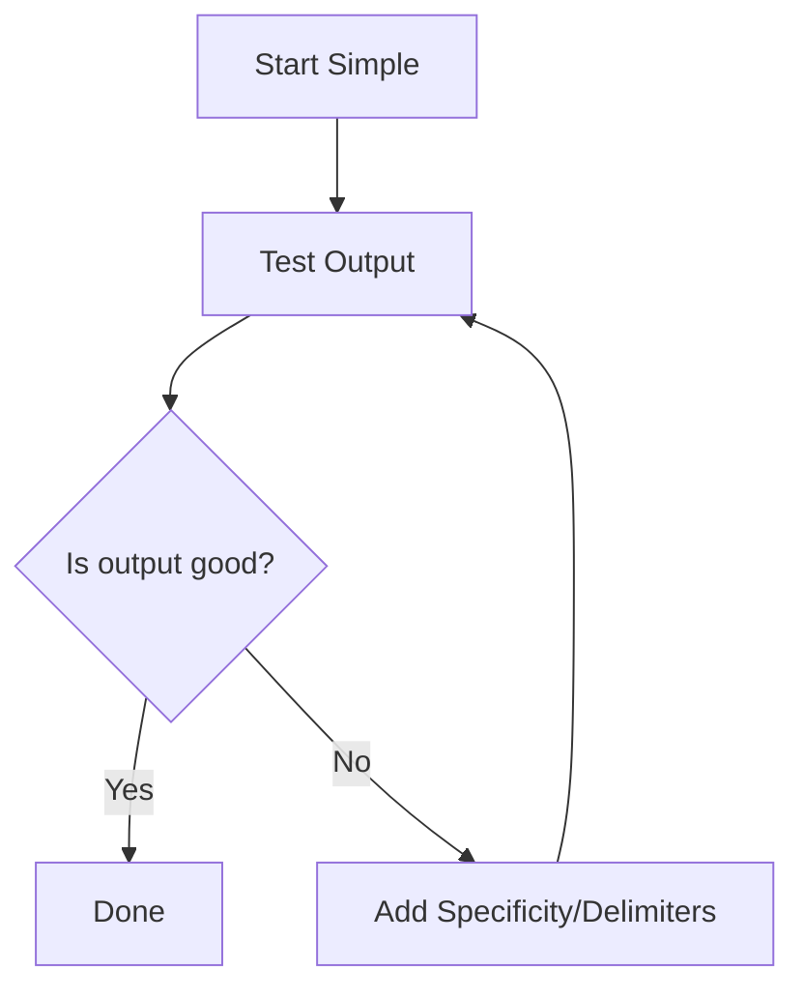
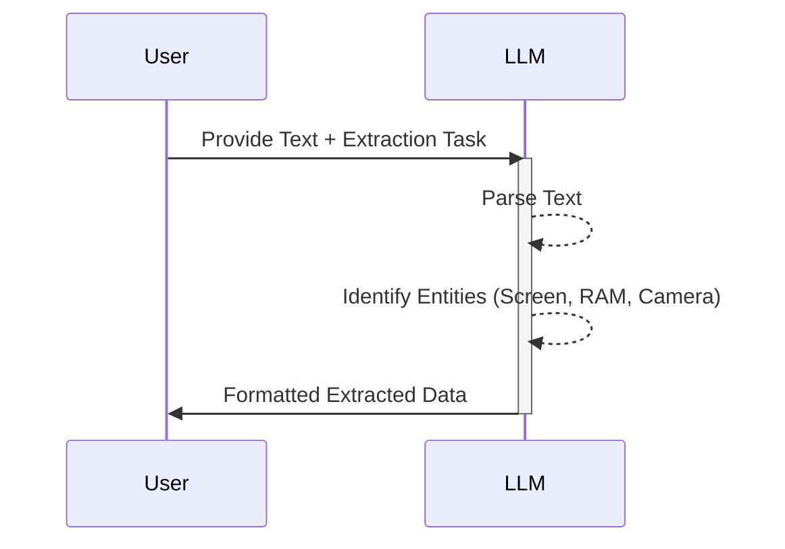

# Prompt Engineering Basics

## Table of Contents
1. Introduction to Prompting
2. Standard Prompts
3. Elements of a Prompt
4. General Tips for Designing Prompts
5. Examples of Prompts

## 1. Introduction to Prompting

Prompt Engineering is the art and science of communicating with Large Language Models (LLMs) effectively. For beginners, it might seem like just typing queries into a chat interface, but it's much more structured. It involves carefully crafting text (the "prompt") to guide the AI towards a desired, highly specific output. 

Understanding prompting is crucial because LLMs are non-deterministic; they can produce vastly different outputs based on subtle changes in input. By mastering prompt engineering, you gain control over the model's behavior, ensuring accuracy, consistency, and alignment with your goals.

```python
# Example of a simple API call showcasing basic prompting
import openai

response = openai.Completion.create(
  model="text-davinci-003",
  prompt="What is Prompt Engineering? Explain it simply.",
  max_tokens=100
)
print(response.choices[0].text.strip())
```



## 2. Standard Prompts

Standard prompts, often referred to as zero-shot prompts, are direct questions or commands without any prior examples. You are relying entirely on the model's pre-existing knowledge. These are the most common ways people interact with AI.

While standard prompts are easy to use, they can sometimes lead to vague or generic answers. To get better results, users must learn to add constraints, specify formats, or ask the model to assume a persona. 

```python
# A standard zero-shot prompt in Python
prompt = "Classify this movie review as positive or negative: 'The cinematography was beautiful, but the plot was completely nonsensical.'"
# The model has to rely on its internal understanding of sentiment.
```



## 3. Elements of a Prompt

A well-crafted prompt usually consists of several distinct elements. While not all are required for every prompt, understanding them gives you a powerful toolkit:

*   **Instruction:** The specific task or directive you want the model to perform.
*   **Context:** Background information that helps the model understand the situation better.
*   **Input Data:** The specific data (text, numbers) the model should process.
*   **Output Indicator:** The desired format or structure of the output (e.g., JSON, a table, a list).

By combining these elements, you dramatically increase the precision of the LLM's response.

```python
# Prompt with distinct elements
instruction = "Extract the names of cities from the text."
context = "You are a geographical data extractor."
input_data = "I visited Paris last summer and plan to go to Tokyo next year."
output_format = "Return the result as a comma-separated list."

full_prompt = f"{context}\n\nTask: {instruction}\nText: {input_data}\nFormat: {output_format}"
print(full_prompt)
```



## 4. General Tips for Designing Prompts

Designing prompts is an iterative process. Here are some fundamental tips for beginners:

1.  **Start Simple:** Begin with a basic prompt and add complexity as needed.
2.  **Be Specific:** Ambiguity is the enemy of good prompting. Clearly define what you want.
3.  **Avoid Negative Phrasing:** Instead of saying "don't do X", say "do Y". Models often understand positive constraints better.
4.  **Use Delimiters:** Use quotes, XML tags, or markdown to clearly separate instructions from input data.

These rules form the foundation of advanced prompt engineering techniques like Few-Shot Prompting or Chain-of-Thought.

```python
# Using delimiters for clarity
prompt = """
Summarize the text enclosed in triple backticks into a single sentence.

```
The quick brown fox jumps over the lazy dog. It was a sunny day and the fox was feeling energetic. The dog, however, preferred to sleep in the shade.
```
"""
```



## 5. Examples of Prompts

Let's look at some practical examples to solidify these concepts. We can categorize prompts by their primary function: text summarization, information extraction, classification, and creative writing.

By studying successful prompts, beginners can build an intuition for how language models interpret instructions and structure their responses based on the provided constraints.

```python
# Example: Information Extraction
prompt_extraction = """
Extract the key features of the product described below.
Product: The new X-Phone has a 6-inch OLED screen, 12GB of RAM, and a 50MP camera.
Features:
- Screen: 
- RAM:
- Camera:
"""
# The model will intuitively fill in the blanks based on the input text.
```


