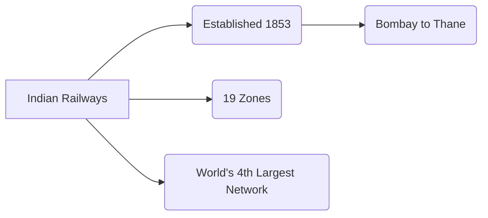

# RRB Exams: General Awareness Study Guide

This guide covers RRB-specific topics and current affairs.

## 1. Current Affairs

*   **Focus Areas:** National news, International news, Awards, Appointments, Books & Authors.
*   **Tips:** Read a daily newspaper and compile monthly magazines. Focus on the last 6 months before the exam.
*   **Example:** Who won the Nobel Peace Prize this year? (Keep this updated based on current year).

## 2. Indian Railways History

*   **First Train:** Ran between Bombay (Bori Bunder) and Thane on 16 April 1853 (34 km).
*   **Zones:** Indian Railways is divided into 19 zones.
*   **Longest Route:** Vivek Express (Dibrugarh to Kanyakumari).
*   **First Electric Train:** Deccan Queen (1929).
*   **Example:** When did the first passenger train run in India? Answer: 1853.

## 3. Sports

*   **Olympics:** Held every 4 years.
*   **Cricket:** World Cup, IPL, important trophies (Ranji, Duleep).
*   **Terminology:** LBW (Cricket), Deuce (Tennis), Checkmate (Chess).
*   **Example:** How many players are there in a standard football team on the field? Answer: 11.

## 4. Famous Personalities

| Personality | Field / Known For |
| :--- | :--- |
| A.P.J. Abdul Kalam | Former President, "Missile Man of India" |
| C.V. Raman | Physicist (Raman Effect) |
| M.S. Swaminathan | Father of the Green Revolution in India |
| Homi J. Bhabha | Father of Indian Nuclear Program |

