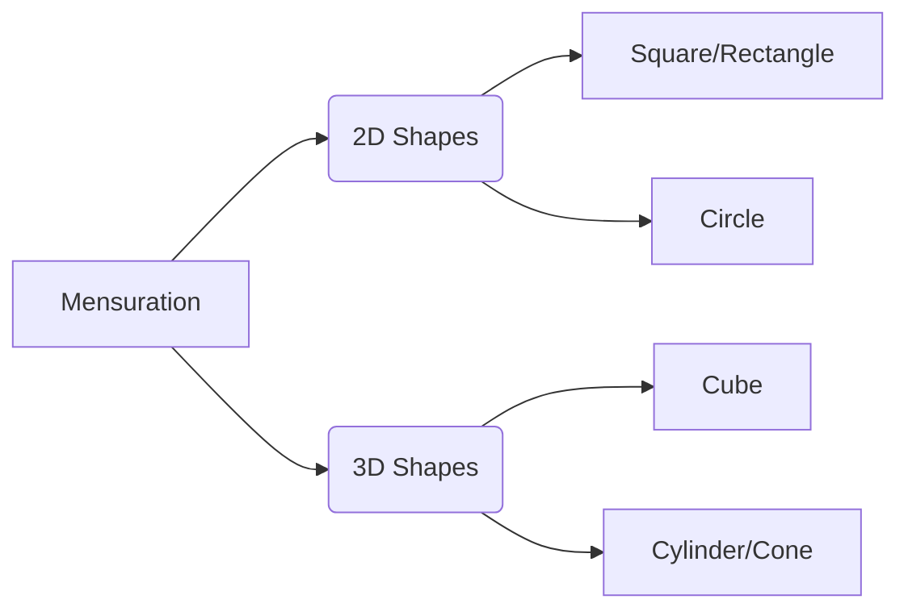

# RRB Exams: Mathematics Study Guide

Comprehensive foundational guide for RRB Mathematics.

## 1. Number Systems

*   **Types of Numbers:**
    *   **Natural Numbers:** 1, 2, 3...
    *   **Whole Numbers:** 0, 1, 2, 3...
    *   **Integers:** ...-2, -1, 0, 1, 2...
    *   **Prime Numbers:** Divisible only by 1 and itself (2, 3, 5, 7, 11...). Note: 2 is the only even prime.
*   **Example:** Is 15 a prime number? Answer: No, because it is divisible by 3 and 5.

## 2. BODMAS Rule

*   **Concept:** Determines the order of operations in mathematical expressions.
    *   **B**rackets ( ) { } [ ]
    *   **O**f (Orders/Exponents)
    *   **D**ivision $\div$
    *   **M**ultiplication $\times$
    *   **A**ddition $+$
    *   **S**ubtraction $-$
*   **Example:** Evaluate $10 + 2 \times 5 - (3 + 1)$
    *   Brackets: $10 + 2 \times 5 - 4$
    *   Multiplication: $10 + 10 - 4$
    *   Addition: $20 - 4$
    *   Subtraction: $16$.

## 3. Decimals and Fractions

*   **Fractions:** Consists of a numerator (top) and denominator (bottom).
    *   *Addition:* Find a common denominator. $1/2 + 1/3 = 3/6 + 2/6 = 5/6$.
*   **Decimals:** Fractions with denominators that are powers of 10.
    *   *Conversion:* $1/4 = 0.25$.
*   **Example:** Convert $0.75$ to a fraction. Answer: $75/100 = 3/4$.

## 4. Mensuration

*   **2D Shapes (Perimeter and Area):**
    *   **Rectangle:** $P = 2(l+b)$, $A = l \times b$
    *   **Square:** $P = 4a$, $A = a^2$
    *   **Circle:** $C = 2\pi r$, $A = \pi r^2$
*   **3D Shapes (Volume and Surface Area):**
    *   **Cube:** $V = a^3$, $SA = 6a^2$
    *   **Cylinder:** $V = \pi r^2 h$, $CSA = 2\pi rh$, $TSA = 2\pi r(r+h)$
*   **Example:** Find the area of a rectangle with length 5cm and breadth 3cm. Answer: $5 \times 3 = 15$ sq cm.

