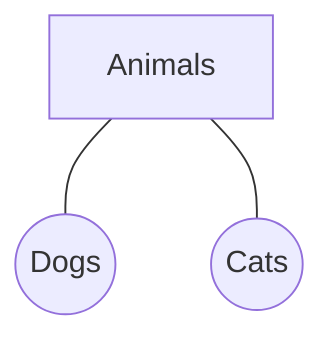

# RRB Exams: General Intelligence Study Guide

A beginner-friendly guide for RRB reasoning sections.

## 1. Coding & Decoding

*   **Concept:** A word or number is encrypted into a code based on a specific rule. You must identify the rule to encode another word or decode the code.
*   **Tips:** Memorize the alphabetical order (A=1, B=2 ... Z=26) and reverse order (Z=1, Y=2).
*   **Example:** In a certain code, 'APPLE' is written as 'BQQMF'. How is 'MANGO' written?
    *   **Logic:** Each letter is shifted by +1. (A->B, P->Q, P->Q, L->M, E->F).
    *   **Answer:** M->N, A->B, N->O, G->H, O->P. So, 'NBOHP'.

## 2. Mathematical Operations

*   **Concept:** Symbols are replaced with mathematical operators based on rules given in the question. Apply BODMAS to solve.
*   **Example:** If '+' means 'multiplied by', '-' means 'added to', 'x' means 'divided by', and '/' means 'subtracted from', then what is the value of: $10 \times 5 / 3 - 2 + 3$?
    *   **Substitution:** Replace symbols: $10 \div 5 - 3 + 2 \times 3$
    *   **BODMAS:** Division ($10/5 = 2$) -> $2 - 3 + 2 \times 3$
    *   Multiplication ($2 \times 3 = 6$) -> $2 - 3 + 6$
    *   Addition/Subtraction -> $2 + 6 - 3 = 8 - 3 = 5$.

## 3. Venn Diagrams

*   **Concept:** Identifying relationships between different classes of items using overlapping circles.
*   **Example:** Which Venn diagram best represents the relationship between: "Animals", "Dogs", and "Cats"?
    *   **Logic:** Dogs and Cats are separate entities, but both are Animals. So, two distinct circles inside one large circle.

## 4. Data Interpretation

*   **Concept:** Analyzing data presented in tables, bar graphs, pie charts, or line graphs to answer questions.
*   **Example:** A pie chart shows student preferences: Math (40%), Science (30%), English (20%), Art (10%). If there are 200 students, how many prefer Science?
    *   **Calculation:** 30% of 200 = $(30/100) \times 200 = 60$ students.
