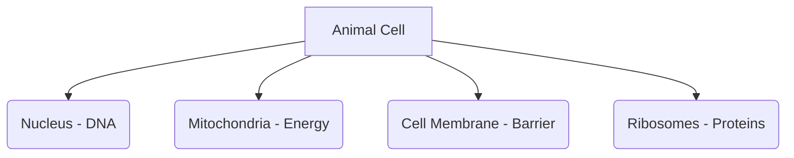
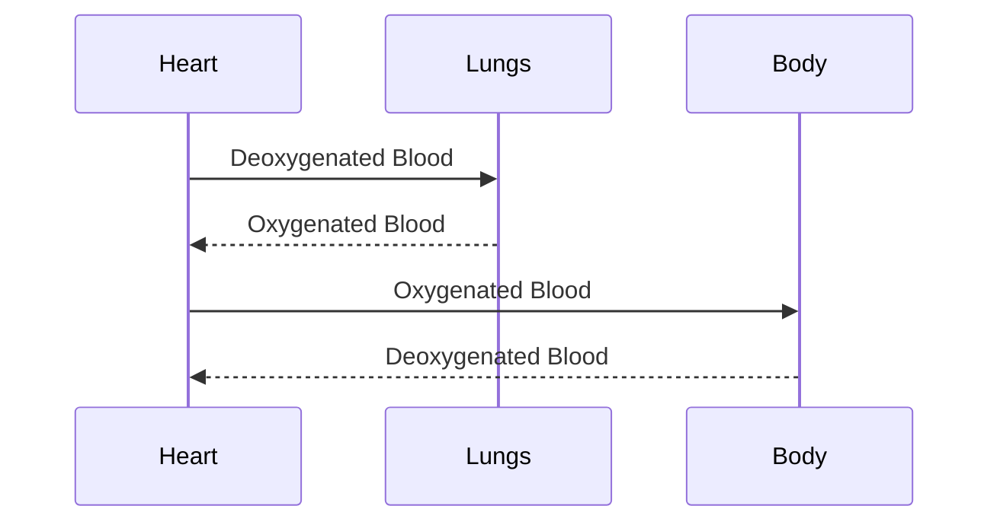

# RRB Exams: General Science Study Guide

Covering 10th standard Physics, Chemistry, and Life Sciences from scratch.

## 1. Physics

### Motion and Force
*   **Velocity:** Displacement / Time ($v = s/t$)
*   **Acceleration:** Change in velocity / Time ($a = (v-u)/t$)
*   **Newton's Laws of Motion:**
    1.  Inertia: An object at rest stays at rest unless acted upon by a force.
    2.  $F = ma$ (Force = mass $\times$ acceleration)
    3.  Every action has an equal and opposite reaction.
*   **Formulas:**
    *   Work = Force $\times$ Distance ($W = F \cdot s$)
    *   Kinetic Energy = $1/2 mv^2$
    *   Potential Energy = $mgh$
*   **Example:** What force is needed to accelerate a 2kg mass by 3 $m/s^2$? Answer: $F = 2 \times 3 = 6$ Newtons.

## 2. Chemistry

### Matter and Atoms
*   **Atomic Structure:** Atoms consist of protons (positive), neutrons (neutral), and electrons (negative).
*   **Atomic Number (Z):** Number of protons.
*   **Mass Number (A):** Number of protons + neutrons.
*   **Acids and Bases:**
    *   Acids: pH < 7, sour taste, turn blue litmus red.
    *   Bases: pH > 7, bitter taste, turn red litmus blue.
*   **Example:** If a solution has a pH of 3, is it an acid or base? Answer: Acid.

## 3. Life Sciences (Biology)

### Cell Biology
*   The cell is the basic unit of life.
*   **Mitochondria:** Powerhouse of the cell (produces ATP).
*   **Nucleus:** Contains DNA (genetic material).
*   **Ribosomes:** Protein synthesis.

### Human Body
*   **Circulatory System:** Heart pumps blood. Arteries carry blood away, veins carry it back.
*   **Respiratory System:** Lungs exchange Oxygen and Carbon Dioxide.
*   **Example:** Which organ is responsible for pumping blood? Answer: The Heart.

