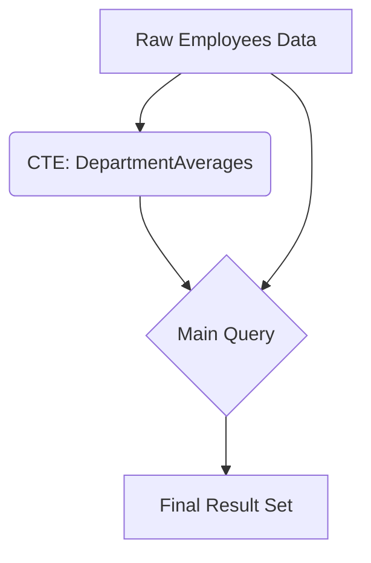
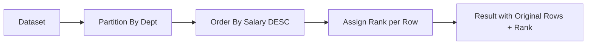
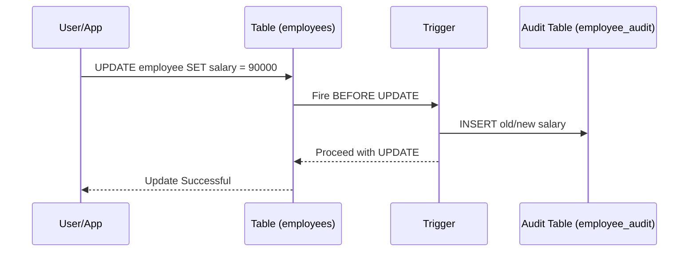

# Advanced SQL - Inspired by PostgreSQL Tutorial

This document dives into advanced SQL features, mirroring the depth of the PostgreSQL Tutorial, to equip you with powerful data manipulation tools.

## 1. Common Table Expressions (CTEs)

### Explanation
A Common Table Expression (CTE) is a temporary result set that you can reference within another `SELECT`, `INSERT`, `UPDATE`, or `DELETE` statement. CTEs are defined using the `WITH` clause. They drastically improve the readability and maintainability of complex queries by breaking them down into simpler, logical building blocks. Unlike subqueries, CTEs can be referenced multiple times in the main query, and they can even refer to themselves (Recursive CTEs).

### Code Example
```sql
-- Using a CTE to find employees earning above their department's average
WITH DepartmentAverages AS (
    SELECT department_id, AVG(salary) as avg_salary
    FROM employees
    GROUP BY department_id
)
SELECT e.first_name, e.last_name, e.salary, d.avg_salary
FROM employees e
JOIN DepartmentAverages d ON e.department_id = d.department_id
WHERE e.salary > d.avg_salary;
```

### Diagram


---

## 2. Window Functions

### Explanation
Window functions perform calculations across a set of table rows that are somehow related to the current row. Unlike aggregate functions (like `SUM` or `MAX` with `GROUP BY`), window functions do not cause rows to become grouped into a single output row; the rows retain their separate identities. This is incredibly useful for calculating running totals, moving averages, ranking items, and accessing data from previous or subsequent rows without using complex self-joins.

### Code Example
```sql
-- Ranking employees by salary within each department
SELECT 
    first_name, 
    department_id, 
    salary,
    RANK() OVER (PARTITION BY department_id ORDER BY salary DESC) as dept_salary_rank
FROM employees;
```

### Diagram


---

## 3. Triggers and Stored Procedures

### Explanation
Stored procedures (or functions in PostgreSQL) are reusable blocks of SQL and procedural code stored on the database server. They encapsulate complex business logic, reducing network traffic and improving performance. Triggers are special types of stored procedures that are automatically executed (fired) in response to specific events on a particular table or view, such as `INSERT`, `UPDATE`, or `DELETE`. Triggers are often used to maintain audit trails or enforce complex data integrity rules.

### Code Example
```sql
-- Creating an audit trigger function
CREATE OR REPLACE FUNCTION log_employee_update()
  RETURNS TRIGGER AS
$$
BEGIN
    IF NEW.salary <> OLD.salary THEN
        INSERT INTO employee_audit(employee_id, old_salary, new_salary, changed_on)
        VALUES(OLD.id, OLD.salary, NEW.salary, now());
    END IF;
    RETURN NEW;
END;
$$
LANGUAGE plpgsql;

-- Attaching the trigger to the table
CREATE TRIGGER employee_salary_update_trigger
  BEFORE UPDATE
  ON employees
  FOR EACH ROW
  EXECUTE PROCEDURE log_employee_update();
```

### Diagram

