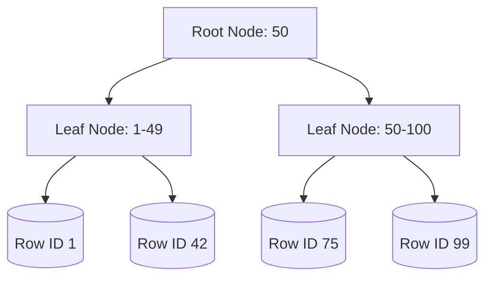
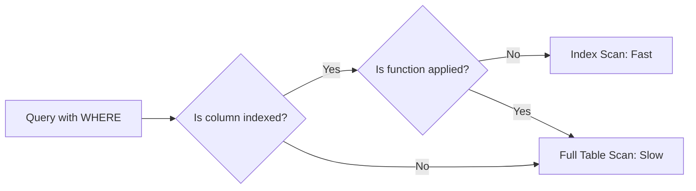
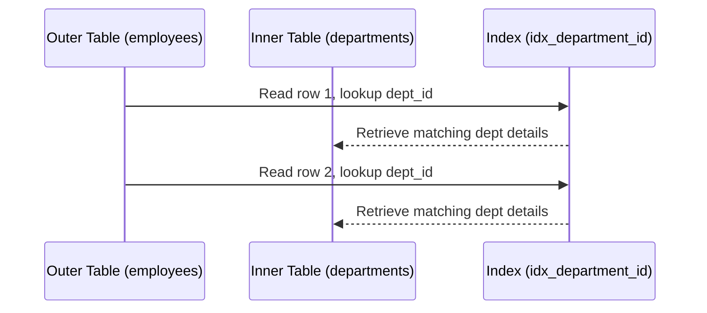

# SQL Concepts - Inspired by Use The Index Luke

This document covers the fundamental concepts of database indexing and performance tuning, mirroring the structure of the famous "Use The Index Luke" guide.

## 1. Anatomy of an Index

### Explanation
An index in a database is similar to an index in a book. It is a separate data structure (usually a B-Tree) that stores a subset of the table's data, ordered in a way that allows the database engine to quickly locate the rows that match a query without having to scan the entire table (a full table scan). When you create an index on a column, the database creates this B-Tree structure, making lookups extremely efficient (logarithmic time complexity).

### Code Example
```sql
-- Creating an index on the employee_id column
CREATE INDEX idx_employee_id ON employees(employee_id);

-- This query will now use the index to find the employee quickly
SELECT first_name, last_name FROM employees WHERE employee_id = 1042;
```

### Diagram


---

## 2. The Where Clause

### Explanation
The `WHERE` clause filters the rows returned by a query. When combined with an index, the database can jump directly to the relevant section of the B-Tree and retrieve only the required rows. However, not all `WHERE` clauses can use indexes effectively. For instance, using functions on indexed columns (e.g., `UPPER(last_name) = 'SMITH'`) often prevents the database from using the index, leading to a full table scan, unless a function-based index is created.

### Code Example
```sql
-- Inefficient: Cannot use a standard index on last_name
SELECT * FROM employees WHERE UPPER(last_name) = 'SMITH';

-- Efficient: Can use a standard index on last_name
SELECT * FROM employees WHERE last_name = 'Smith';

-- Creating a function-based index for the inefficient query
CREATE INDEX idx_upper_last_name ON employees(UPPER(last_name));
```

### Diagram


---

## 3. The Join Operation

### Explanation
Joins combine columns from one or more tables into a new result set. The database engine employs different algorithms to execute joins, such as Nested Loop Joins, Hash Joins, and Merge Joins. Indexes play a crucial role in Nested Loop Joins. If there is an index on the join column of the inner table, the database can quickly look up matching rows for each row in the outer table, drastically reducing the overall execution time.

### Code Example
```sql
-- Joining employees and departments tables
-- An index on departments.department_id is highly recommended
SELECT e.first_name, d.department_name
FROM employees e
JOIN departments d ON e.department_id = d.department_id;
```

### Diagram

