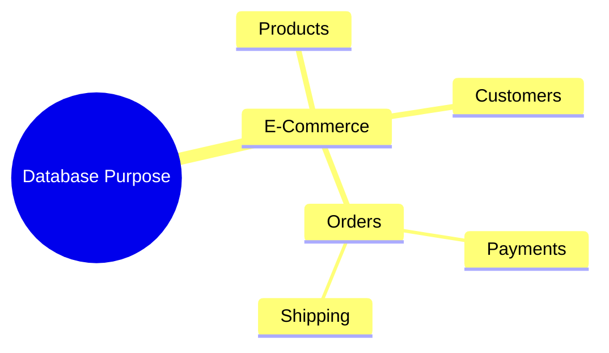
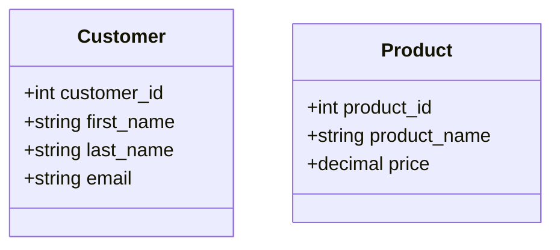
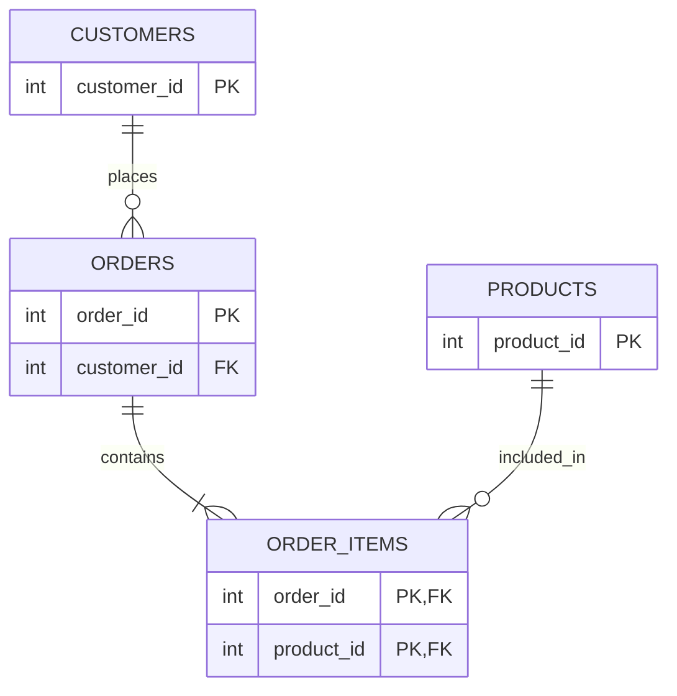
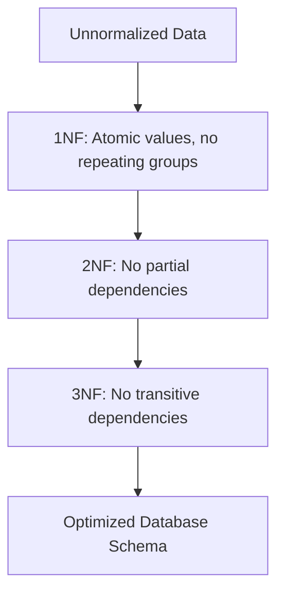

# Database Design - Inspired by IBM DB Design

This document outlines the systematic process of designing a robust and scalable relational database, drawing inspiration from IBM's database design guidelines.

## 1. Determine the Purpose and Gather Information

### Explanation
The first step in database design is to clearly understand the purpose of the database and gather all the necessary information it must hold. This involves interviewing stakeholders, analyzing existing forms, reports, and manual processes. You need to identify the core entities (things, people, events) that the business cares about. This phase is crucial; a poorly understood requirement leads to a fundamentally flawed database schema that is hard to modify later.

### Code Example
```sql
-- Conceptual phase - translating requirements to initial table drafts
-- Requirement: We need to track customers and their orders.
-- Draft Entities: Customer, Order

-- Note: No executable SQL yet, this is the conceptual mapping phase.
-- We are identifying nouns: 'Customer', 'Order', 'Product'.
```

### Diagram


---

## 2. Divide Information into Tables and Columns

### Explanation
Once you have your entities, you divide them into separate tables. A table should represent one subject only (e.g., a table for Customers, a table for Orders). Mixing subjects in a single table leads to data redundancy and inconsistencies. Next, determine the columns (attributes) for each table. Each column should represent a single, atomic piece of information (e.g., `first_name` and `last_name` instead of a combined `full_name`).

### Code Example
```sql
-- Creating distinct tables with atomic columns
CREATE TABLE customers (
    customer_id INT PRIMARY KEY,
    first_name VARCHAR(50),
    last_name VARCHAR(50),
    email VARCHAR(100) UNIQUE
);

CREATE TABLE products (
    product_id INT PRIMARY KEY,
    product_name VARCHAR(100),
    price DECIMAL(10, 2)
);
```

### Diagram


---

## 3. Specify Keys and Set Up Relationships

### Explanation
Every table needs a Primary Key—a column (or set of columns) that uniquely identifies each row. To establish relationships between tables, you use Foreign Keys. A foreign key in one table points to the primary key in another table. There are three main types of relationships: One-to-One, One-to-Many (the most common, e.g., one customer has many orders), and Many-to-Many (which requires a junction/linking table).

### Code Example
```sql
-- Establishing a One-to-Many relationship using a Foreign Key
CREATE TABLE orders (
    order_id INT PRIMARY KEY,
    order_date DATE,
    customer_id INT,
    -- Foreign key linking back to the customers table
    FOREIGN KEY (customer_id) REFERENCES customers(customer_id)
);

-- Establishing a Many-to-Many relationship (Orders and Products)
CREATE TABLE order_items (
    order_id INT,
    product_id INT,
    quantity INT,
    PRIMARY KEY (order_id, product_id),
    FOREIGN KEY (order_id) REFERENCES orders(order_id),
    FOREIGN KEY (product_id) REFERENCES products(product_id)
);
```

### Diagram


---

## 4. Apply Normalization Rules

### Explanation
Normalization is the process of organizing data to minimize redundancy and dependency. It involves dividing large tables into smaller, related tables according to a set of rules called Normal Forms (1NF, 2NF, 3NF). 
- **1NF:** Eliminate repeating groups and ensure atomic values.
- **2NF:** Ensure all non-key columns depend on the entire primary key.
- **3NF:** Ensure no transitive dependencies (non-key columns should not depend on other non-key columns).

### Code Example
```sql
-- Denormalized (Bad): Store dependency in same table
-- CREATE TABLE employees (id INT, name VARCHAR, dept_name VARCHAR, dept_head VARCHAR);

-- Normalized to 3NF (Good): Separate into departments table
CREATE TABLE departments (
    dept_id INT PRIMARY KEY,
    dept_name VARCHAR(50),
    dept_head VARCHAR(50)
);

CREATE TABLE employees (
    emp_id INT PRIMARY KEY,
    name VARCHAR(50),
    dept_id INT,
    FOREIGN KEY (dept_id) REFERENCES departments(dept_id)
);
```

### Diagram

