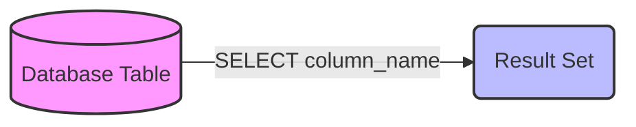
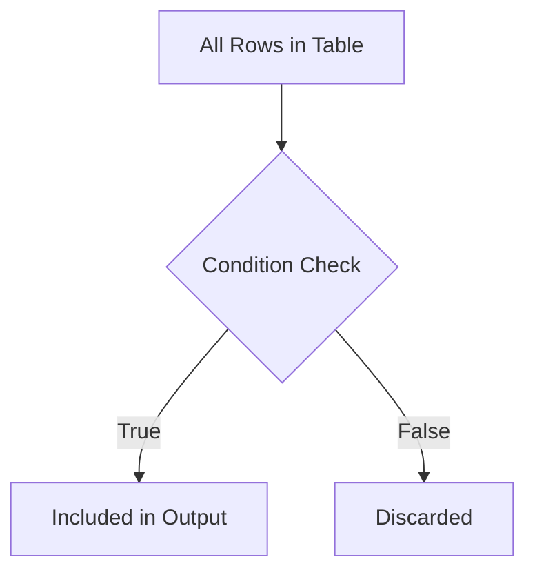
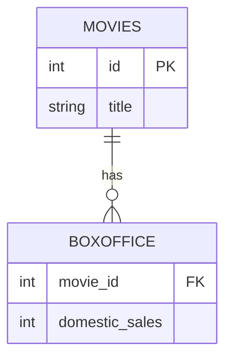

# SQL Queries - Inspired by SQLBolt

This document provides a comprehensive guide to fundamental SQL queries, mirroring the step-by-step approach of SQLBolt.

## 1. SELECT Queries 101

### Explanation
The `SELECT` statement is the most basic and frequently used command in SQL. It is used to query or retrieve data from a table in the database. You can select specific columns by listing their names separated by commas, or you can select all columns using the asterisk (`*`) wildcard. A fundamental best practice for data analytics is to only `SELECT` the columns you actually need, reducing memory consumption and network transfer time.

### Code Example
```sql
-- Select all columns from the movies table
SELECT * FROM movies;

-- Select specific columns (title and release year)
SELECT title, release_year FROM movies;
```

### Diagram


---

## 2. Queries with Constraints (Filtering)

### Explanation
To filter the results of a `SELECT` query, you use the `WHERE` clause. This allows you to specify conditions that the data must meet to be included in the result set. You can use standard comparison operators (`=`, `!=`, `<`, `>`, `<=`, `>=`) and logical operators (`AND`, `OR`, `NOT`). The `LIKE` operator is used for pattern matching with wildcards (`%` for any sequence of characters, `_` for a single character).

### Code Example
```sql
-- Find movies released after 2010
SELECT title, release_year FROM movies 
WHERE release_year > 2010;

-- Find movies directed by Christopher Nolan or Steven Spielberg
SELECT title, director FROM movies 
WHERE director = 'Christopher Nolan' OR director = 'Steven Spielberg';

-- Find movies starting with 'The'
SELECT title FROM movies WHERE title LIKE 'The %';
```

### Diagram


---

## 3. Multi-table Queries with JOINs

### Explanation
Databases are typically normalized, meaning data is split across multiple related tables to avoid redundancy. To query data that spans multiple tables, you use `JOIN` operations. The `INNER JOIN` (or simply `JOIN`) returns only the rows where there is a match in both tables based on a specified condition (usually matching primary and foreign keys). `LEFT JOIN` returns all rows from the left table and the matched rows from the right table.

### Code Example
```sql
-- Inner Join: Get movie titles and their corresponding box office sales
SELECT movies.title, boxoffice.domestic_sales, boxoffice.international_sales
FROM movies
INNER JOIN boxoffice 
    ON movies.id = boxoffice.movie_id;

-- Left Join: Get all movies, and their sales if available (NULL if not)
SELECT m.title, b.rating
FROM movies m
LEFT JOIN boxoffice b 
    ON m.id = b.movie_id;
```

### Diagram

