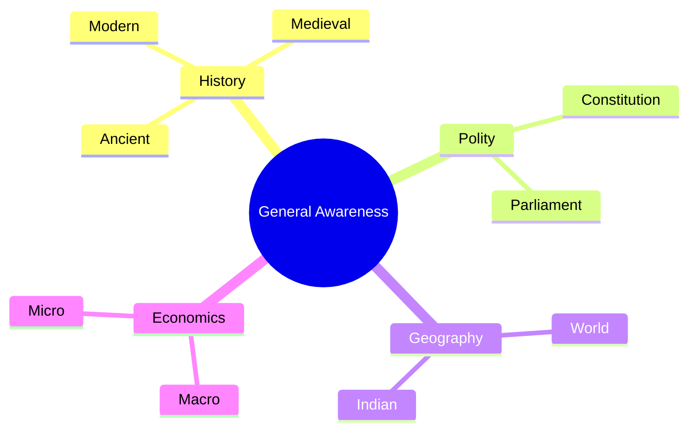

# SSC Exams: General Awareness Study Guide

This guide covers history, polity, geography, economics, and static GK.

## 1. History (Indian)

### Important Timeline

| Year | Event | Details |
| :--- | :--- | :--- |
| 1526 | First Battle of Panipat | Babur defeated Ibrahim Lodi, establishing Mughal rule. |
| 1757 | Battle of Plassey | British EIC defeated Siraj-ud-Daulah. |
| 1857 | First War of Independence | Sepoy Mutiny against British rule. |
| 1942 | Quit India Movement | Launched by Mahatma Gandhi. |
| 1947 | India gains Independence | End of British Raj. |

## 2. Polity (Indian Constitution)

### Important Articles

| Article | Description |
| :--- | :--- |
| Article 14 | Equality before law. |
| Article 17 | Abolition of Untouchability. |
| Article 19 | Protection of certain rights regarding freedom of speech, etc. |
| Article 21 | Protection of life and personal liberty. |
| Article 32 | Remedies for enforcement of Fundamental Rights (Heart & Soul). |

## 3. Geography

*   **Solar System:** 8 planets. Jupiter is the largest, Mercury is the smallest. Venus is the hottest.
*   **Indian Geography:**
    *   **Longest River:** Ganga.
    *   **Highest Peak in India:** Kanchenjunga (undisputed).
    *   **Largest State (Area):** Rajasthan.
*   **Example:** Which is the longest river in India? Answer: Ganga.

## 4. Economics

*   **GDP (Gross Domestic Product):** Total value of goods and services produced within a country in a year.
*   **Inflation:** General increase in prices and fall in the purchasing value of money.
*   **Repo Rate:** The rate at which the RBI lends money to commercial banks.
*   **Example:** If prices are rising rapidly, the economy is experiencing inflation.

## 5. Static GK

*   **Firsts in India:**
    *   First President: Dr. Rajendra Prasad.
    *   First Prime Minister: Pt. Jawaharlal Nehru.
    *   First Woman Prime Minister: Indira Gandhi.

