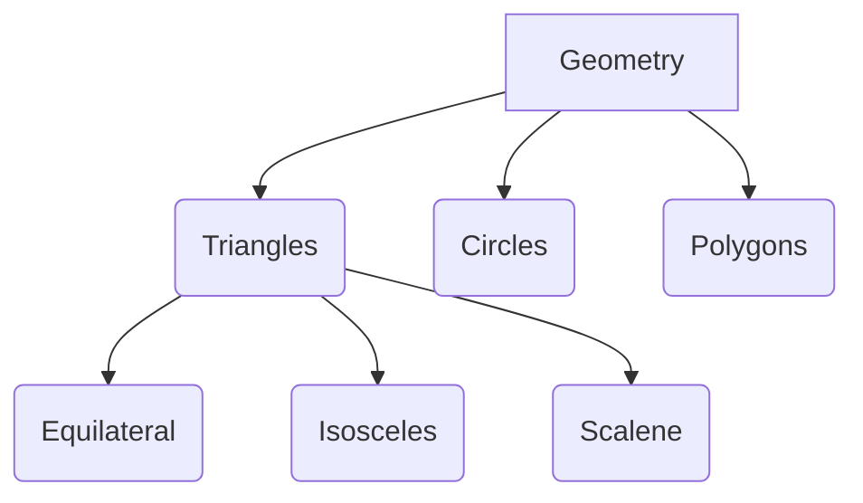

# SSC Exams: Quantitative Aptitude Study Guide

This guide is designed for beginners to learn Quantitative Aptitude from scratch.

## 1. Arithmetic

### Percentages
*   **Concept:** A fraction with a denominator of 100. % means "per hundred".
*   **Shortcut Formula:** To find $x\%$ of $y$, calculate $(x/100) \times y$.
*   **Fraction to Percentage:** $1/2 = 50\%$, $1/3 = 33.33\%$, $1/4 = 25\%$, $1/5 = 20\%$.
*   **Example:** What is 20% of 150? $(20/100) \times 150 = 30$.

### Profit and Loss
*   **Formulas:**
    *   $\text{Profit} = \text{Selling Price (SP)} - \text{Cost Price (CP)}$
    *   $\text{Loss} = \text{Cost Price (CP)} - \text{Selling Price (SP)}$
    *   $\text{Profit \%} = (\text{Profit} / \text{CP}) \times 100$
    *   $\text{Loss \%} = (\text{Loss} / \text{CP}) \times 100$
*   **Shortcut:** If a person sells two similar items, one at a gain of $x\%$ and another at a loss of $x\%$, then there is always a loss given by $(x/10)^2 \%$.
*   **Example:** CP = 100, SP = 120. Profit = 20. Profit % = (20/100)*100 = 20%.

### Simple and Compound Interest
*   **Formulas:**
    *   $\text{Simple Interest (SI)} = \frac{P \times R \times T}{100}$
    *   $\text{Amount (CI)} = P \times (1 + \frac{R}{100})^n$
    *   $\text{Compound Interest (CI)} = \text{Amount} - P$
*   **Shortcut (Difference between CI and SI for 2 years):** $\text{Diff} = P(R/100)^2$
*   **Example:** P=1000, R=10%, T=2 yrs. SI = (1000*10*2)/100 = 200.

## 2. Algebra

*   **Identities:**
    *   $(a+b)^2 = a^2 + b^2 + 2ab$
    *   $(a-b)^2 = a^2 + b^2 - 2ab$
    *   $a^2 - b^2 = (a-b)(a+b)$
    *   $(a+b)^3 = a^3 + b^3 + 3ab(a+b)$
    *   $a^3 + b^3 + c^3 - 3abc = (a+b+c)(a^2+b^2+c^2-ab-bc-ca)$
*   **Shortcut:** If $x + 1/x = a$, then $x^2 + 1/x^2 = a^2 - 2$.
*   **Example:** If $x + 1/x = 3$, find $x^2 + 1/x^2$. Answer: $3^2 - 2 = 7$.

## 3. Geometry

### Triangles
*   **Area:** $1/2 \times \text{base} \times \text{height}$ or Heron's formula $\sqrt{s(s-a)(s-b)(s-c)}$
*   **Pythagorean Theorem:** In a right-angled triangle, hypotenuse² = base² + perpendicular².
*   **Example:** Triangle with sides 3, 4, 5 is right-angled because $3^2 + 4^2 = 5^2$.

### Circles
*   **Area:** $\pi r^2$
*   **Circumference:** $2\pi r$
*   **Properties:** Angles subtended by the same arc at the circumference are equal.

## 4. Trigonometry

*   **Ratios:**
    *   $\sin(\theta) = \text{Perpendicular} / \text{Hypotenuse}$
    *   $\cos(\theta) = \text{Base} / \text{Hypotenuse}$
    *   $\tan(\theta) = \text{Perpendicular} / \text{Base}$
*   **Identities:**
    *   $\sin^2(\theta) + \cos^2(\theta) = 1$
    *   $1 + \tan^2(\theta) = \sec^2(\theta)$
*   **Standard Values:** $\sin(30^\circ) = 1/2$, $\cos(60^\circ) = 1/2$, $\tan(45^\circ) = 1$.
*   **Example:** Evaluate $\sin^2(45^\circ) + \cos^2(45^\circ)$. Answer: 1 (from identity).

