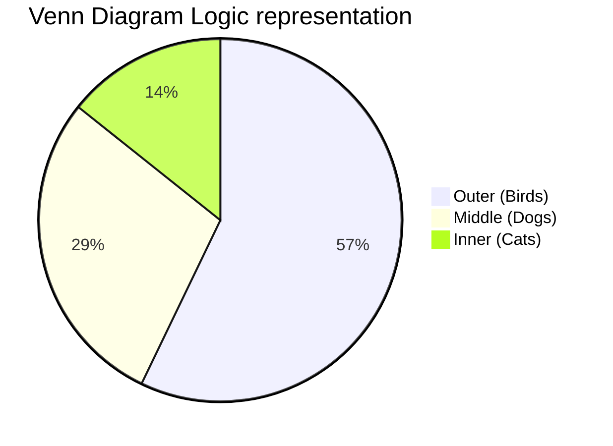
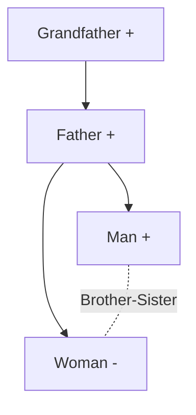

# SSC Exams: General Intelligence & Reasoning Study Guide

This guide covers all key topics from scratch with logical examples.

## 1. Analogies

*   **Concept:** Finding the relationship between a given pair of words/numbers/letters and applying the same to find the missing pair.
*   **Example (Word):** Doctor : Hospital :: Teacher : ?
    *   **Logic:** A doctor works in a hospital; similarly, a teacher works in a School.
*   **Example (Number):** 4 : 16 :: 5 : ?
    *   **Logic:** $4^2 = 16$. So, $5^2 = 25$.

## 2. Syllogism

*   **Concept:** Drawing conclusions from two or more given statements, assuming them to be true.
*   **Tips:** Always use Venn diagrams to solve.
*   **Example:**
    *   Statement 1: All cats are dogs.
    *   Statement 2: All dogs are birds.
    *   Conclusion: All cats are birds. (True, based on transitive logic).
    

## 3. Blood Relations

*   **Concept:** Determining the relation between two individuals based on given information.
*   **Tips:** Draw a family tree. Use '+' for male, '-' for female. Use horizontal lines for siblings, vertical for generations, double lines for couples.
*   **Example:** Pointing to a photograph, a man says, "She is the daughter of my grandfather's only son." How is the woman related to the man?
    *   **Logic:** Grandfather's only son = Man's father. Daughter of man's father = Man's sister.

## 4. Non-Verbal Reasoning

*   **Concept:** Problems based on figures, patterns, and shapes instead of words.
*   **Topics:** Series, Analogy, Classification, Mirror Images, Water Images, Paper Folding.
*   **Example (Mirror Image):** If a clock shows 3:00, its mirror image will show 9:00.
    *   **Logic:** $12:00 - 3:00 = 9:00$.
